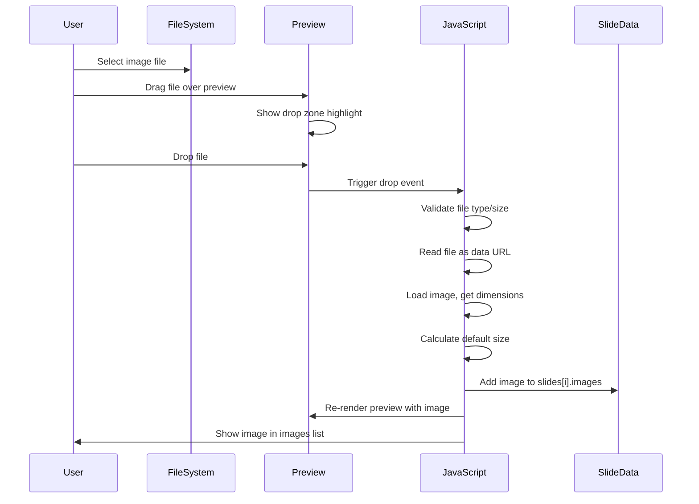
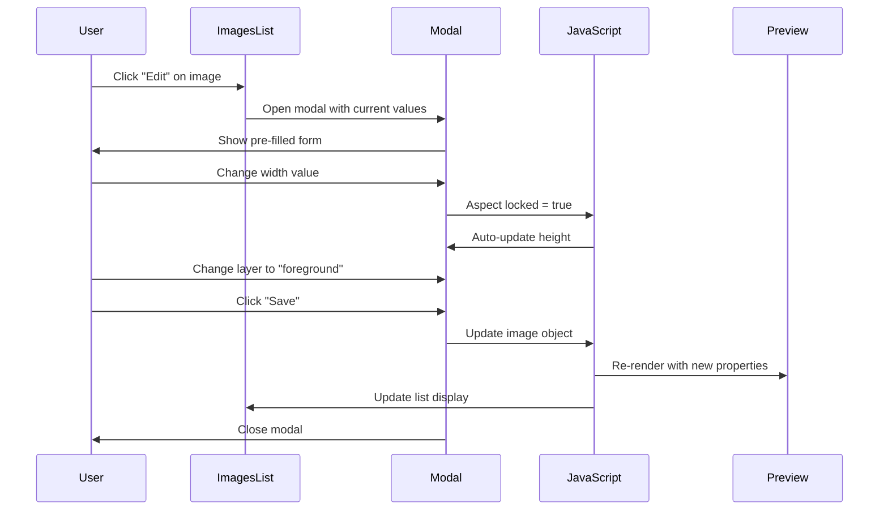

# Image and Background Management Enhancement

## Feature Overview

Enhance the slide editor's image insertion and management capabilities to support multiple upload methods and comprehensive editing controls for image sizing and layering relative to text content.

## Context

The slide editor currently supports basic image insertion via URL only (lines 99-110, 282-317 in slide_editor.html). Images are added with fixed position and size parameters. This enhancement expands image handling to match modern web application standards and provides fine-grained control over image presentation.

## User Requirements

### 1. Multiple Image Upload Methods

Users must be able to add images through three distinct pathways:

- **URL Input**: Paste a direct image URL
- **Drag and Drop**: Drag image files from file explorer into the preview window
- **File Selection**: Click to open native file picker dialog for browsing local files

All three methods must support common image formats: JPEG, PNG, GIF, WebP, and SVG.

### 2. Image Editing Controls

After inserting an image, users must be able to adjust:

- **Size**: Width and height dimensions with aspect ratio lock option
- **Layering**: Position image behind text (background layer) or in front of text (foreground layer)

## Functional Design

### Image Upload Flow

#### URL Input Method
Maintains existing behavior with enhanced validation:
- Input field accepts https:// or http:// URLs
- Validate URL format before adding to slide
- Display error message for invalid or inaccessible URLs

#### Drag and Drop Method
Interaction sequence:
1. User drags image file from file system
2. Hover over slide preview area triggers visual drop zone indicator
3. On drop, file is read and converted to data URL or uploaded to temporary storage
4. Image is inserted at drop coordinates with default dimensions

Technical considerations:
- Drop zone must be limited to the slide preview container
- Show visual feedback (border highlight or overlay message) during drag-over state
- Handle multiple simultaneous drops by adding all images sequentially
- Prevent default browser behavior (opening file in new tab)

#### File Selection Method
Standard file picker workflow:
1. User clicks "Choose File" or similar button in image modal
2. Native OS file picker opens
3. User selects one or multiple image files
4. Selected files are processed identically to drag-and-drop flow

### Image Storage Strategy

#### Option A: Data URL Embedding
Images are converted to base64 data URLs and stored directly in slide data structure.

**Advantages**:
- No server storage needed
- Works offline
- Simple implementation

**Disadvantages**:
- Large slide data payload
- Slow serialization for many images
- Browser localStorage limits

#### Option B: Temporary Server Storage
Images uploaded to server endpoint, returning public URL for slide reference.

**Advantages**:
- Compact slide data
- Faster processing
- No client storage limits

**Disadvantages**:
- Requires server endpoint
- Network dependency
- Temporary URL lifetime management

**Recommended Approach**: Start with Option A (data URLs) for simplicity, migrate to Option B if performance issues arise.

### Image Data Model

Each image object in slide.images array contains:

| Property | Type | Description |
|----------|------|-------------|
| id | string | Unique identifier (timestamp-based) |
| url | string | Image source (URL or data URL) |
| position | object | {x: number, y: number} in pixels |
| size | object | {width: number, height: number} in pixels |
| layer | string | "background" or "foreground" |
| aspectRatio | number | Original width/height ratio |
| aspectLocked | boolean | Maintain aspect ratio during resize |

### Image Editing Interface

Editing controls appear in the image management section when an image is selected from the list.

#### Size Controls

Layout:
- Width input field (number, pixels)
- Height input field (number, pixels)
- Aspect ratio lock toggle (checkbox or icon button)

Behavior:
- When aspect ratio is locked, changing width automatically adjusts height proportionally
- Manual unlock allows independent dimension changes
- Display original dimensions as placeholder hint
- Real-time preview update as values change

#### Layer Controls

Interface element: Radio button group or toggle switch with two options:
- **Behind Text**: Image renders below text elements (z-index lower than text layer)
- **In Front of Text**: Image renders above text elements (z-index higher than text layer)

Default value: Behind Text (background layer)

Preview behavior:
- Preview window must visually reflect layer ordering
- Text should be readable regardless of layer choice (consider semi-transparent overlay indicator)

### Enhanced Image Modal

The existing image modal (lines 282-317) must be expanded to include:

#### Upload Method Tabs
Three tab buttons at top of modal:
- "URL" (default active)
- "Drag & Drop"
- "Upload File"

Active tab determines which UI is displayed below.

#### Tab Content Layouts

**URL Tab**:
- URL input field
- Same as current implementation

**Drag & Drop Tab**:
- Large drop zone area with dashed border
- Instructional text: "Drag image file here or click to browse"
- Click on drop zone triggers file picker as fallback
- Display dropped file name once selected

**Upload File Tab**:
- File input button
- Supported formats hint text
- Preview thumbnail of selected file

#### Common Controls (All Tabs)

Position section:
- X coordinate input (pixels)
- Y coordinate input (pixels)

Size section:
- Width input (pixels)
- Height input (pixels)
- Aspect ratio lock checkbox

Layer section:
- Radio buttons: Behind Text / In Front of Text

Action buttons:
- "Add Image" button (validates and closes modal)
- "Cancel" button (discards and closes modal)

### Image List Enhancement

The existing images list display (lines 106-109) must show additional information:

Each list item displays:
- Thumbnail preview (small, e.g., 40x40px)
- Image source truncated to 30 characters
- Layer indicator badge ("BG" or "FG")
- Edit button (opens modal with current image settings pre-filled)
- Delete button (existing functionality)

List item example structure:

```
[Thumbnail] image.jpg... [BG badge] [Edit] [Delete]
```

### Preview Rendering Logic

The slide preview must render images with correct layering:

Rendering order (bottom to top):
1. Slide background color
2. Images with layer="background"
3. Text elements (title, main text, secondary text)
4. Images with layer="foreground"
5. Tables, arrows, and other overlays

Each image element in preview:
- Positioned absolutely using CSS top/left based on x/y coordinates
- Sized using CSS width/height based on size properties
- z-index assigned based on layer property

### Coordinate System Mapping

Preview coordinates vs. final presentation coordinates:

The preview window has a fixed aspect ratio (16:9 or 9:16) but variable pixel dimensions based on screen size. Image coordinates stored in slide data are in preview pixels.

During presentation generation:
- Preview pixel coordinates must be converted to EMU (English Metric Units)
- Conversion formula: EMU = (pixel / previewWidth) * slideWidthEMU
- slideWidthEMU = 9144000 for horizontal, 5143500 for vertical orientation

Coordinate origin:
- (0, 0) is top-left corner of slide
- X increases rightward
- Y increases downward

### File Upload Processing

For drag-and-drop and file picker methods:

1. **File Validation**
   - Check file.type matches allowed MIME types
   - Check file.size does not exceed limit (e.g., 5MB per image)
   - Display error if validation fails

2. **File Reading**
   - Use FileReader API to read file as data URL
   - Show loading indicator during read operation
   - Handle read errors gracefully

3. **Image Loading**
   - Create temporary Image object to load data URL
   - Wait for image.onload event
   - Extract naturalWidth and naturalHeight for aspect ratio
   - Calculate default display size (e.g., scale to fit 50% of slide width)

4. **Data Storage**
   - Add image object to slides[currentSlideIndex].images array
   - Trigger updateImagesList() and preview re-render
   - Clear file input for next upload

### Error Handling

Error scenarios and user feedback:

| Error Condition | User Message | Recovery Action |
|----------------|--------------|-----------------|
| Invalid URL format | "Please enter a valid image URL" | Keep modal open, highlight input |
| URL not accessible | "Unable to load image from URL" | Keep modal open, suggest checking URL |
| Unsupported file type | "File type not supported. Use JPG, PNG, GIF, WebP, or SVG" | Allow file re-selection |
| File too large | "File exceeds 5MB limit. Please use a smaller image" | Allow file re-selection |
| Image load failure | "Failed to load image. Try another file" | Remove failed image from list |

## API Integration

### Google Slides API Usage

Image insertion uses the `createImage` request type (existing implementation in presentation_builder.py).

Enhanced parameters:

```
{
  "createImage": {
    "url": "string (URL or data URL)",
    "elementProperties": {
      "pageObjectId": "slideId",
      "size": {
        "width": {"magnitude": number, "unit": "EMU"},
        "height": {"magnitude": number, "unit": "EMU"}
      },
      "transform": {
        "scaleX": 1,
        "scaleY": 1,
        "translateX": number (EMU),
        "translateY": number (EMU),
        "unit": "EMU"
      }
    }
  }
}
```

Layer ordering implementation:
- Images with layer="background" are inserted first in batch request
- Text elements inserted next
- Images with layer="foreground" inserted last
- Insertion order determines z-index in Google Slides

### Backend Changes Required

presentation_builder.py modifications:

1. **Sort images by layer before insertion**
   - Filter images into background and foreground groups
   - Insert background images before text
   - Insert foreground images after text

2. **Data URL handling**
   - Google Slides API supports data URLs for createImage
   - No server-side conversion needed if using data URLs
   - For server storage option: implement upload endpoint returning public URL

3. **Coordinate conversion**
   - Existing _pt_to_emu() utility function
   - Add _px_to_emu() for pixel-based coordinates
   - Account for preview dimensions in conversion

## User Interaction Flow

### Adding Image via Drag and Drop



### Editing Image Properties



## UI Component Specifications

### Drop Zone Styling

Visual state indicators:

| State | Border | Background | Text |
|-------|--------|------------|------|
| Inactive | 2px dashed gray-300 | transparent | "Drag image here" (gray-500) |
| Hover (drag over) | 2px dashed blue-500 | blue-50 | "Drop to add image" (blue-700) |
| Processing | 2px solid blue-500 | blue-100 | "Loading..." with spinner |
| Error | 2px dashed red-500 | red-50 | Error message (red-700) |

Dimensions: Full width of modal content area, minimum height 150px

### Layer Badge Styling

Small badge displayed in image list item:

- "BG" badge: gray background, white text, small rounded corners
- "FG" badge: blue background, white text, small rounded corners
- Position: Inline after image name, before edit button

### Aspect Ratio Lock Icon

Toggle button appearance:
- Locked state: Chain link icon, blue color
- Unlocked state: Broken chain icon, gray color
- Position: Between width and height inputs

## Technical Constraints

### Browser Compatibility

Required browser features:
- FileReader API (supported in all modern browsers)
- Drag and Drop API (supported in all modern browsers)
- Data URL support (universal)

No polyfills needed for target browsers (Chrome, Firefox, Edge, Safari latest versions).

### Performance Considerations

Optimization strategies:

1. **Image Size Limits**
   - Enforce 5MB maximum per image
   - Recommend compression before upload for large files

2. **Preview Rendering**
   - Use CSS transforms for positioning instead of JavaScript
   - Limit preview re-renders to user input debouncing

3. **Data URL Storage**
   - Monitor localStorage usage
   - Warn user when approaching browser limits
   - Provide option to reduce image quality

4. **Batch Processing**
   - For multiple file uploads, process sequentially to avoid memory spikes
   - Show individual progress for each image

### Accessibility

Keyboard navigation:
- Tab through upload method tabs
- File picker triggered by Enter/Space on drop zone
- Edit/Delete buttons keyboard accessible

Screen reader support:
- Descriptive labels for all form inputs
- Announce image additions to images list
- Error messages read aloud

## Future Enhancements

Potential features for subsequent iterations:

1. **Image Cropping**: In-modal crop tool before adding to slide
2. **Image Filters**: Brightness, contrast, saturation adjustments
3. **Smart Positioning**: Snap to grid or align with text elements
4. **Background Fill Modes**: Cover, contain, tile options for background images
5. **Image Library**: Save frequently used images for quick reuse
6. **Batch Operations**: Select multiple images for layer or size changes
7. **Undo/Redo**: Revert image changes without manual re-editing

## Success Criteria

Feature is complete when:

- Users can add images via URL, drag-and-drop, and file picker
- All three upload methods support JPEG, PNG, GIF, WebP, and SVG
- Images can be resized with aspect ratio lock option
- Images can be positioned behind or in front of text
- Preview accurately reflects image layer ordering
- Generated presentations correctly render images with specified layers
- File size validation prevents uploads exceeding 5MB
- Error messages clearly guide users for invalid inputs
- Image list displays thumbnails, layer badges, and edit controls
- Editing an image pre-fills modal with current settings

## Related Documentation

Existing implementation:
- templates/slide_editor.html (lines 99-110, 282-317, 858-919)
- presentation_design/generation/presentation_builder.py (_add_image method)
- SLIDE_EDITOR_ENHANCEMENT_SUMMARY.md (Image Placement section)

API references:
- Google Slides createImage documentation
- FileReader API (MDN Web Docs)
- HTML5 Drag and Drop API (MDN Web Docs)- FileReader API (MDN Web Docs)
