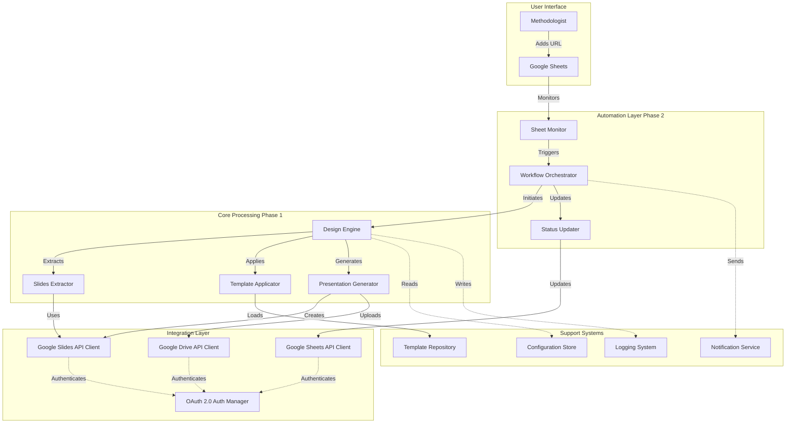
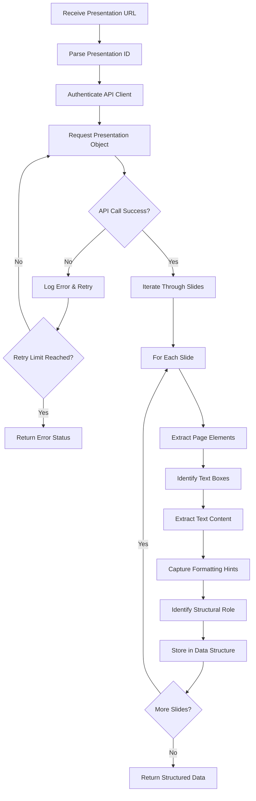
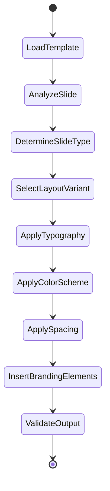
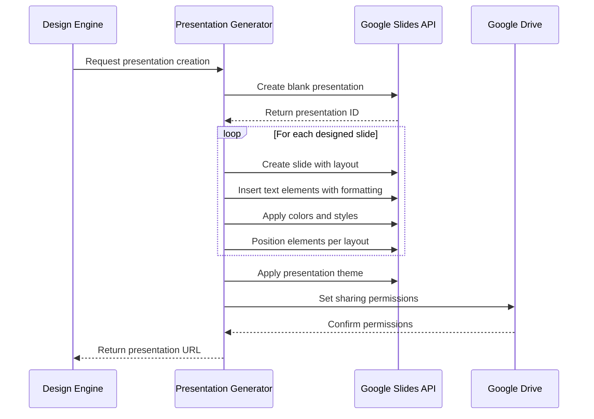
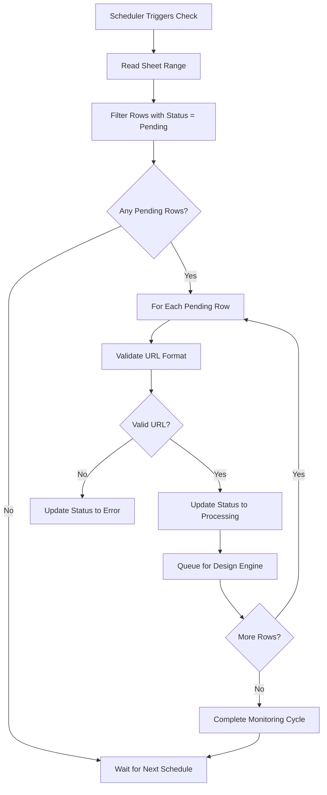
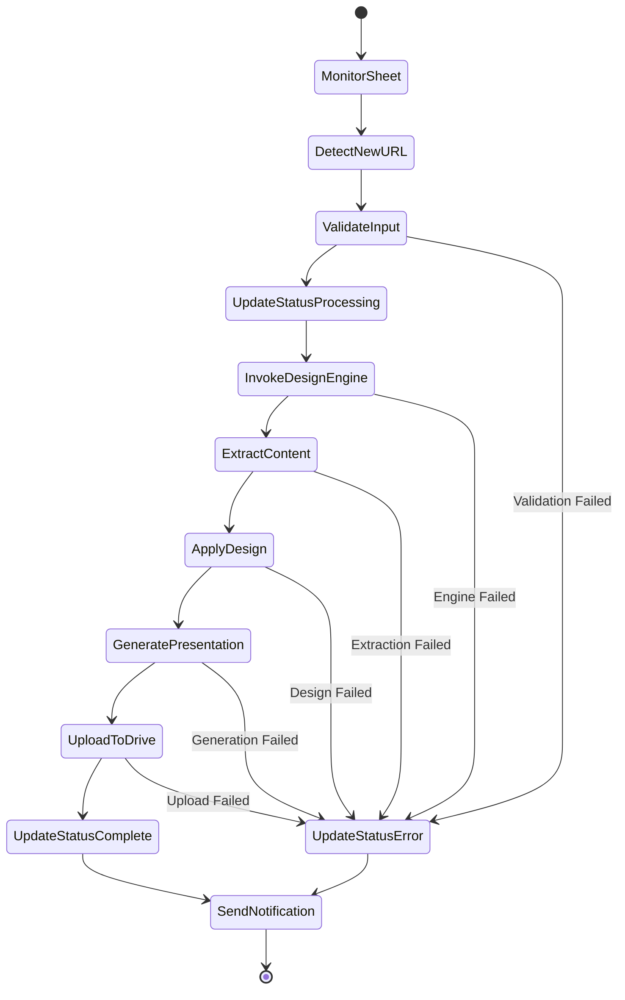
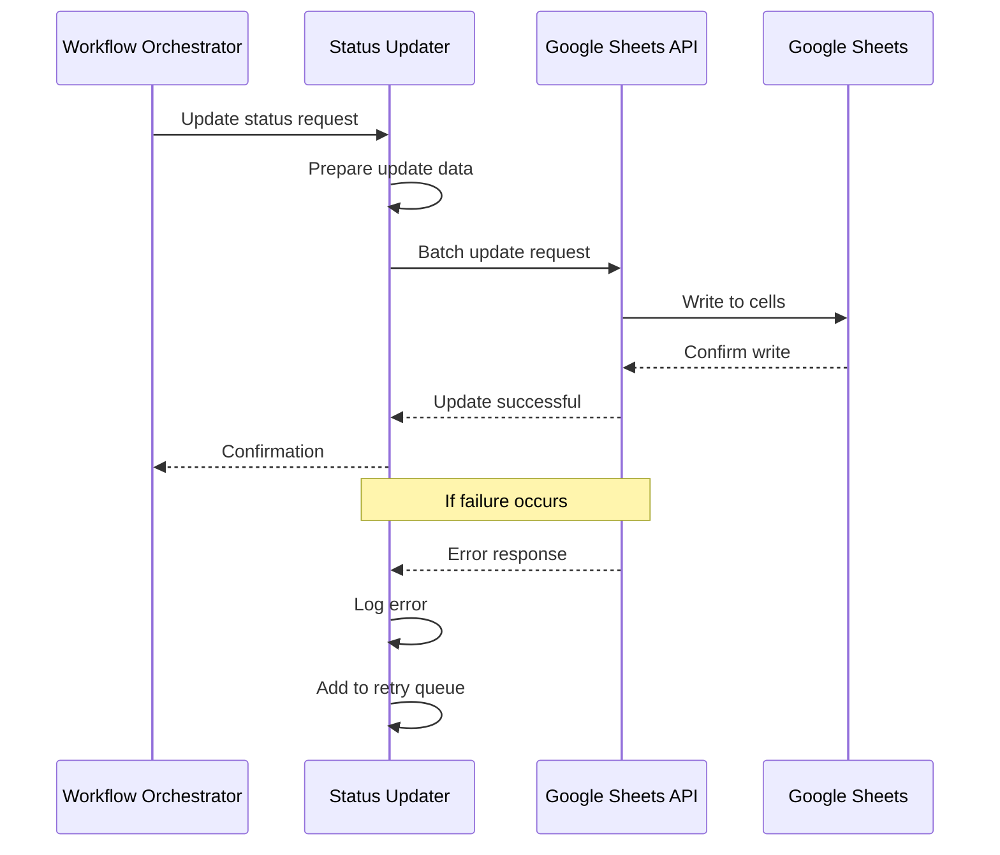
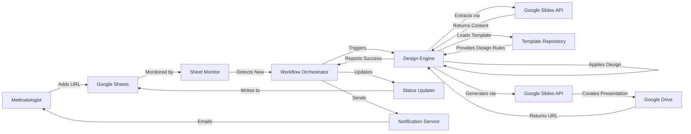
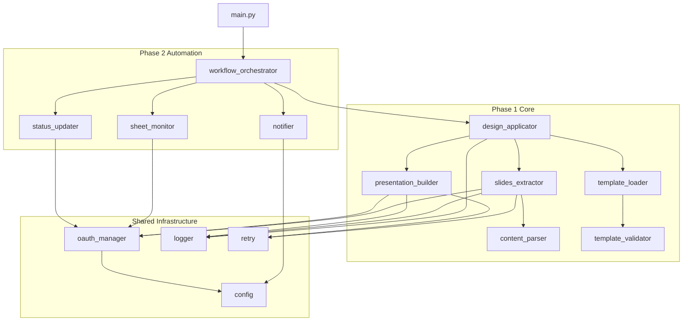

# Automated Presentation Design System

## Overview

An automated system that extracts text from Google Slides presentations, applies design templates, and generates styled presentations with minimal human intervention (under 3 minutes review time). The system integrates with Google Sheets for workflow management and Google Drive for storage.

## System Context

The system serves methodologists who manage presentation creation workflows through Google Sheets. By providing a Google Slides URL in a tracking spreadsheet, the system automatically processes the presentation through a design pipeline and outputs a professionally styled result.

## Strategic Goals

- Minimize manual design work from hours to minutes
- Ensure consistent design quality across all presentations
- Enable non-designers to produce professional presentations
- Maintain traceability of processing status through Google Sheets
- Support scalable processing of multiple presentations

## Scope

### In Scope (Phase 1: Core Design Engine)

- Google Slides API authentication and authorization
- Text and structure extraction from Google Slides
- Template-based design system
- Design application to presentation content
- Generation of newly designed presentations
- Error handling and operation logging

### In Scope (Phase 2: Automation Integration)

- Google Sheets monitoring for new presentation URLs
- Automated processing pipeline triggers
- Status tracking in Google Sheets
- Google Drive upload and storage
- Notification system for completion and errors
- Scheduled task execution

### Out of Scope

- Image generation or AI-based visual content creation
- Real-time collaborative editing
- Custom design creation interface
- Multi-language translation
- Version control of presentations

## Architecture Overview

### High-Level Components

| Component | Purpose | Technology Foundation |
|-----------|---------|----------------------|
| Design Engine Service | Core presentation processing logic | Python application |
| Google API Integration Layer | Communication with Google services | Google API Client Libraries |
| Template Management System | Storage and retrieval of design templates | File-based or database storage |
| Workflow Orchestrator | Monitors sheets and triggers processing | Scheduler (cron) or event-driven (webhooks) |
| Storage Manager | Handles presentation file operations | Google Drive API |
| Notification Service | Alerts users of status changes | Email or webhook notifications |
| Configuration Manager | Centralized system configuration | JSON-based configuration |
| Logging System | Audit trail and debugging | File-based structured logging |

### System Architecture



## Detailed Design

### Phase 1: Core Design Engine

#### Authentication and Authorization Component

**Purpose**: Secure access to Google Slides API using OAuth 2.0 protocol.

**Responsibilities**:
- Manage OAuth 2.0 authentication flow
- Store and refresh access tokens
- Handle credential expiration and renewal
- Validate API access permissions

**Key Behaviors**:
- On first use, initiate OAuth consent flow to obtain user authorization
- Store refresh tokens securely for subsequent automated access
- Before each API call, validate token freshness and refresh if needed
- Handle authentication errors with retry logic

**Configuration Requirements**:

| Parameter | Description | Source |
|-----------|-------------|--------|
| Client ID | OAuth application identifier | Google Cloud Console |
| Client Secret | OAuth application secret | Google Cloud Console |
| Redirect URI | OAuth callback endpoint | Application configuration |
| Scopes | API access permissions required | Application configuration |
| Token Storage Path | Location for credential persistence | Configuration file |

**Error Scenarios**:
- Invalid credentials: Log error and halt processing
- Expired token without refresh capability: Trigger re-authentication flow
- Insufficient permissions: Report required scopes and request re-authorization

#### Slides Content Extractor

**Purpose**: Extract text, structure, and metadata from Google Slides presentations.

**Extraction Data Model**:

| Entity | Attributes | Purpose |
|--------|-----------|---------|
| Presentation | ID, title, slide count, locale | Overall presentation metadata |
| Slide | Position index, layout type, page elements | Individual slide structure |
| Text Element | Content, font properties, position, hierarchy level | Textual content with formatting hints |
| Shape | Type, dimensions, position | Non-text visual elements |
| Layout Metadata | Master slide reference, placeholder types | Template compatibility hints |

**Extraction Process Flow**:



**Structural Role Identification**:
- Title slides: Detected by position index and text hierarchy
- Section headers: Identified by text size and slide layout type
- Body content: Remaining text elements with normal hierarchy
- Footer elements: Position-based detection at slide bottom

#### Template System

**Purpose**: Define and manage reusable design patterns for presentation styling.

**Template Structure**:

| Component | Attributes | Application Logic |
|-----------|-----------|-------------------|
| Typography Rules | Font families, sizes, weights, line heights per hierarchy level | Applied based on text role (title, heading, body) |
| Color Scheme | Primary, secondary, accent, background, text colors with hex codes | Mapped to presentation theme colors |
| Layout Definitions | Margin specifications, content area boundaries, element spacing | Applied to slide master layouts |
| Slide Type Mappings | Template variants for title, content, section, closing slides | Selected based on slide structural role |
| Branding Elements | Logo placement, consistent footer, header patterns | Inserted as fixed elements per slide type |

**Template Storage Format**:

Templates are stored as structured data (JSON or YAML format) containing:
- Metadata: Template name, version, author, creation date
- Style definitions: Complete typography and color specifications
- Layout configurations: Positioning rules and spacing parameters
- Asset references: Paths to logo images, background patterns, custom fonts

**Template Application Strategy**:



#### Design Application Engine

**Purpose**: Transform extracted content by applying template specifications.

**Application Process**:

The design application accepts structured slide data and a template specification, then produces a new presentation structure with design rules applied.

**Transformation Rules**:

| Input Element | Template Rule | Output Transformation |
|---------------|---------------|----------------------|
| Title text | Title typography + primary color | Formatted title with specified font, size, weight, color |
| Heading text | Heading typography + secondary color | Formatted heading preserving hierarchy |
| Body text | Body typography + text color | Formatted paragraphs with line spacing |
| Bullet lists | List formatting rules | Consistent bullet style and indentation |
| Slide background | Background color or pattern | Applied to slide master |
| Overall layout | Margin and spacing rules | Repositioned elements within safe areas |

**Design Application Algorithm**:

For each slide in extracted data:
- Determine slide type based on content structure
- Retrieve corresponding template variant
- Map each text element to typography rule based on hierarchy
- Apply color scheme to all elements
- Recalculate positions according to layout grid
- Insert template-defined branding elements
- Validate element boundaries remain within safe areas
- Store transformed slide specification

**Quality Validation**:
- Ensure all text remains readable (no truncation or overflow)
- Verify color contrast meets accessibility standards
- Confirm no overlapping elements
- Check that all required template elements are present

#### Presentation Generator

**Purpose**: Create a new Google Slides presentation with applied design.

**Generation Process**:



**Creation Strategy**:

The generator builds presentations incrementally:
- Initialize new presentation with basic metadata
- For each slide, create slide object with appropriate master layout
- Populate text elements with content and formatting
- Apply positioning transformations
- Set theme-level properties (color scheme, fonts)
- Configure sharing and access permissions

**Output Specifications**:

| Attribute | Value | Justification |
|-----------|-------|---------------|
| Presentation Title | Original title + " (Designed)" suffix | Clear differentiation from source |
| Ownership | Service account or user account | Determined by authentication method |
| Sharing Permissions | Editable by organization or specific users | Configurable per deployment |
| Storage Location | Specified Google Drive folder | Organized output management |

#### Error Handling and Logging

**Error Categories and Responses**:

| Error Type | Detection | Response Strategy |
|------------|-----------|-------------------|
| Authentication Failure | OAuth errors, 401 responses | Log details, attempt token refresh, escalate if persistent |
| Network Timeout | API call timeout | Exponential backoff retry up to configured limit |
| Invalid Presentation URL | Parsing failure, 404 responses | Log error, mark task as failed, notify user |
| API Quota Exceeded | 429 responses | Pause processing, wait for quota reset, resume |
| Template Not Found | File system or database lookup failure | Log error, use fallback default template if available |
| Content Extraction Failure | Malformed presentation structure | Log details, skip problematic elements, continue with partial data |
| Generation Failure | API errors during creation | Rollback partial presentation, log full context, report failure |

**Logging Strategy**:

Structured logging with the following information per operation:
- Timestamp with timezone
- Operation type and phase
- Presentation identifier (ID or URL)
- Success or failure status
- Error details if applicable (exception type, message, stack trace)
- Processing duration
- User or service account identifier

**Log Format**:

Logs are written in structured format (JSON) to support automated analysis:
- Each log entry is a single line with JSON object
- Severity levels: DEBUG, INFO, WARNING, ERROR, CRITICAL
- Contextual fields: request_id, user_id, presentation_id, operation

**Log Rotation**:
- Daily log files with date suffix
- Retention period configurable (default: 30 days)
- Automatic compression of archived logs

### Phase 2: Automation Integration

#### Google Sheets Monitor

**Purpose**: Detect new presentation URLs added to tracking spreadsheet.

**Monitoring Strategy**:

| Approach | Mechanism | Trade-offs |
|----------|-----------|------------|
| Polling | Scheduled check every N minutes | Simple implementation, controllable load, slight delay |
| Webhook | Google Apps Script trigger on sheet edit | Near real-time, more complex setup, requires endpoint |
| Hybrid | Polling with change detection via version/timestamp | Balance of simplicity and efficiency |

**Recommended Approach**: Polling with change detection

**Sheet Structure Expectations**:

| Column | Purpose | Format |
|--------|---------|--------|
| Presentation URL | Source presentation link | Valid Google Slides URL |
| Status | Processing state | Enumerated values: Pending, Processing, Complete, Error |
| Template Name | Which design template to apply | String matching template identifier |
| Output URL | Link to generated presentation | Populated after successful processing |
| Timestamp | When row was added or updated | ISO 8601 datetime |
| Error Message | Details if processing failed | Text description of error |

**Change Detection Logic**:



**Concurrency Control**:
- Lock mechanism prevents multiple instances from processing same row
- Status update to "Processing" serves as distributed lock
- Timeout mechanism reverts "Processing" to "Pending" after configured duration

#### Workflow Orchestrator

**Purpose**: Coordinate the end-to-end processing pipeline from detection to completion.

**Orchestration Flow**:



**Task Queue Management**:

Tasks are processed with the following characteristics:
- Sequential processing to respect API rate limits
- Configurable concurrency level for parallel processing if quotas allow
- Priority queue support (if needed for urgent requests)
- Retry queue for transient failures

**State Persistence**:

Processing state is persisted to enable recovery from interruptions:
- Each task has unique identifier
- Current phase and retry count tracked
- Intermediate outputs stored temporarily
- Cleanup of completed or failed task artifacts after retention period

#### Status Updater

**Purpose**: Maintain accurate processing status in Google Sheets for user visibility.

**Update Operations**:

| Trigger Event | Status Value | Additional Updates |
|---------------|--------------|-------------------|
| URL detected | Processing | Set timestamp to current time |
| Design engine starts | Processing | Update with estimated completion time |
| Processing completes | Complete | Write output URL, set completion timestamp |
| Error occurs | Error | Write error message, set error timestamp |

**Update Process**:



**Batch Update Optimization**:
- Group multiple status updates into single API call when possible
- Reduce API quota consumption
- Improve performance for high-volume processing

#### Google Drive Storage Manager

**Purpose**: Upload generated presentations to organized storage locations.

**Upload Strategy**:

| Aspect | Specification |
|--------|---------------|
| Target Folder | Configurable Drive folder ID for all outputs |
| Naming Convention | Original name + " (Designed)" + timestamp suffix |
| File Organization | Option to create subfolders by date or template name |
| Duplicate Handling | Append version number if name collision occurs |
| Sharing Permissions | Inherit from parent folder or set explicitly per configuration |

**Upload Process**:

After presentation generation:
- Retrieve presentation file from Slides API
- Upload to specified Drive folder
- Set metadata (description, properties)
- Configure sharing permissions
- Generate shareable link
- Return link for status update

**Storage Quotas**:
- Monitor available Drive storage
- Alert when approaching quota limits
- Implement archival or cleanup policies for old presentations

#### Notification Service

**Purpose**: Inform users of processing outcomes and system status.

**Notification Triggers**:

| Event | Recipient | Message Content |
|-------|-----------|-----------------|
| Processing Complete | Methodologist who added URL | Success message with link to designed presentation |
| Processing Failed | Methodologist who added URL | Error description and suggested remediation |
| Daily Summary | System administrators | Count of processed, failed, pending presentations |
| System Error | System administrators | Critical error details requiring intervention |

**Notification Channels**:

Configurable per deployment:
- Email notifications via SMTP or email service API
- Webhook to external system (Slack, Teams, custom endpoint)
- In-sheet comment or note on relevant row

**Message Templates**:

Structured message templates with placeholders:
- Success template: Includes presentation title, output URL, processing time
- Error template: Includes presentation title, error category, troubleshooting tips
- Summary template: Statistics and health metrics

#### Scheduler Configuration

**Purpose**: Execute monitoring and processing tasks on regular intervals.

**Scheduling Options**:

| Option | Implementation | Use Case |
|--------|----------------|----------|
| Cron Job | System cron or scheduled task | Simple deployments on single server |
| Cloud Scheduler | Google Cloud Scheduler, AWS EventBridge | Cloud-native deployments with managed infrastructure |
| Application Scheduler | Python schedule library or APScheduler | Self-contained application without external dependencies |

**Recommended Schedule**:
- Sheet monitoring: Every 5 minutes during business hours
- Daily summary generation: Once per day at end of business hours
- Health check and cleanup: Once per hour
- Log rotation: Daily at midnight

**Schedule Configuration Format**:

Stored in configuration file:
- Monitoring interval in minutes
- Business hours definition (start time, end time, timezone)
- Retry intervals and maximum retry counts
- Timeout values for each processing phase

## Data Flow

### End-to-End Processing Flow



### Data Transformations

**Stage 1: Extraction**

Input: Google Slides presentation URL

Output: Structured data representation

| Field | Data Type | Example |
|-------|-----------|---------|
| presentation_id | String | "1A2B3C4D5E6F" |
| title | String | "Q4 Business Review" |
| slides | Array of Slide objects | List containing slide data |
| Each Slide.index | Integer | 0, 1, 2... |
| Each Slide.elements | Array of Element objects | Text boxes, shapes |
| Each Element.type | Enum | "TEXT", "SHAPE", "IMAGE" |
| Each Element.content | String | Actual text content |
| Each Element.role | Enum | "TITLE", "HEADING", "BODY" |

**Stage 2: Design Application**

Input: Structured slide data + Template specification

Output: Designed presentation specification

| Field | Data Type | Example |
|-------|-----------|---------|
| template_name | String | "Corporate Blue" |
| designed_slides | Array of Designed Slide objects | Transformed slide data |
| Each Slide.layout_type | String | "TITLE", "CONTENT", "SECTION" |
| Each Slide.styled_elements | Array of Styled Element objects | Elements with applied formatting |
| Each Element.font_family | String | "Roboto" |
| Each Element.font_size | Integer (points) | 24 |
| Each Element.color | Hex String | "#1A237E" |
| Each Element.position | Object {x, y, width, height} | Coordinates in slide units |

**Stage 3: Generation**

Input: Designed presentation specification

Output: Google Slides presentation

| Field | Data Type | Example |
|-------|-----------|---------|
| presentation_id | String | "9Z8Y7X6W5V4U" |
| presentation_url | String | "https://docs.google.com/presentation/d/..." |
| slide_count | Integer | 12 |
| creation_timestamp | ISO 8601 DateTime | "2024-01-15T14:30:00Z" |

## Configuration Management

### Configuration Structure

Configuration is centralized in a structured file (JSON format):

| Section | Parameters | Purpose |
|---------|------------|---------|
| authentication | client_id, client_secret, token_path, scopes | Google API authentication |
| google_sheets | spreadsheet_id, range, status_column, url_column | Sheet monitoring configuration |
| templates | default_template, template_directory, fallback_behavior | Template management |
| processing | retry_count, timeout_seconds, batch_size | Processing behavior |
| storage | drive_folder_id, naming_pattern, permissions | Output storage |
| scheduling | monitor_interval_minutes, business_hours | Automation timing |
| notifications | enabled, email_from, email_to, webhook_url | Alert configuration |
| logging | log_level, log_file_path, retention_days | Logging behavior |

### Configuration Validation

On application startup:
- Verify all required configuration parameters are present
- Validate format of IDs, URLs, and paths
- Test authentication credentials
- Confirm template files exist and are readable
- Check write permissions for log and output directories

### Environment-Specific Configuration

Support for multiple deployment environments:
- Development: Local credentials, verbose logging, short intervals
- Staging: Test credentials, moderate logging, production-like intervals
- Production: Production credentials, error-level logging, optimized intervals

Configuration file selection via environment variable or command-line argument.

## Error Handling Strategy

### Error Classification

| Category | Severity | Retry Strategy | User Impact |
|----------|----------|----------------|-------------|
| Transient Network | Low | Exponential backoff, max 3 retries | Brief delay, auto-recovery |
| API Rate Limit | Medium | Wait for quota reset, resume | Delayed processing |
| Invalid Input | Medium | No retry, mark as failed | Requires user correction |
| Authentication Failure | High | Retry once, then escalate | Processing halted until resolved |
| System Error | Critical | No retry, alert administrators | Service interruption |

### Retry Logic

**Exponential Backoff Algorithm**:

For transient errors:
- First retry: Wait 1 second
- Second retry: Wait 2 seconds
- Third retry: Wait 4 seconds
- Maximum retries: 3 attempts
- After max retries: Mark task as failed, log details, notify administrators

**Quota Management**:

When API quota exceeded:
- Detect 429 HTTP status code
- Extract retry-after header if present
- Pause processing for specified duration
- Resume when quota resets
- If quota issues persist, alert administrators to review quota allocation

### Graceful Degradation

When non-critical features fail:
- If notification service unavailable: Log error, continue processing
- If default template missing: Use hardcoded fallback template
- If storage folder inaccessible: Store in root directory temporarily

## Security Considerations

### Credential Management

- OAuth credentials stored in secure location with restricted file permissions
- Environment variables used for sensitive configuration in production
- No credentials committed to version control
- Regular rotation of service account keys (recommended: every 90 days)

### API Access Scopes

Minimum required scopes:
- Google Slides API: Read and write access to presentations
- Google Sheets API: Read and write access to spreadsheets
- Google Drive API: File upload and metadata modification

Avoid requesting broader permissions than necessary.

### Data Privacy

- Processing is ephemeral: no long-term storage of presentation content
- Logs contain presentation IDs, not sensitive content
- Access to generated presentations controlled by Drive permissions
- Service account access audited regularly

### Input Validation

- Validate all URLs match Google Slides format before processing
- Sanitize any user-provided template names to prevent directory traversal
- Limit presentation size to prevent resource exhaustion

## Performance Considerations

### Processing Capacity

Expected throughput:
- Single presentation processing time: 30-90 seconds (depending on slide count)
- With 5-minute monitoring interval: Up to 3 presentations per interval
- Daily capacity: Approximately 100-150 presentations (assuming 8-hour workday)

### Optimization Strategies

| Aspect | Optimization | Benefit |
|--------|-------------|---------|
| API Calls | Batch requests when possible | Reduced quota consumption |
| Template Loading | Cache templates in memory | Faster repeated application |
| Authentication | Reuse authenticated client | Avoid repeated auth overhead |
| Concurrent Processing | Process multiple presentations in parallel (with quota awareness) | Higher throughput |
| Change Detection | Track last processed row to avoid re-scanning entire sheet | Reduced API calls |

### Resource Requirements

Estimated system requirements:
- CPU: Minimal, I/O bound workload
- Memory: 512 MB - 1 GB for application runtime
- Storage: 100 MB for application, logs, and temporary files
- Network: Stable internet connection for API access

## Testing Strategy

### Phase 1 Testing

**Unit Testing**:
- Authentication flow with mock credentials
- Content extraction with sample presentation
- Template loading and validation
- Design application logic with test data
- Presentation generation with API mocks

**Integration Testing**:
- End-to-end flow from extraction to generation with real test presentation
- Error handling with deliberately malformed inputs
- Retry logic with simulated transient failures

**Test Data Requirements**:
- Sample presentations with various structures (title slides, content slides, complex layouts)
- Multiple template configurations
- Test Google account with API access enabled

### Phase 2 Testing

**Additional Unit Testing**:
- Sheet monitoring with mock sheet data
- Status update operations
- Notification delivery

**Additional Integration Testing**:
- Complete workflow from sheet detection to output delivery
- Concurrent processing of multiple presentations
- Scheduler behavior over extended periods

**System Testing**:
- Performance testing with realistic workload
- Recovery from various failure scenarios
- Security testing of credential handling

## Deployment Architecture

### Deployment Options

| Option | Infrastructure | Pros | Cons |
|--------|---------------|------|------|
| Local Server | On-premise machine or VM | Full control, no cloud costs | Requires maintenance, single point of failure |
| Cloud VM | GCP Compute Engine, AWS EC2 | Scalable, managed infrastructure | Ongoing cloud costs |
| Serverless | Cloud Functions, AWS Lambda | Pay-per-use, auto-scaling | Cold starts, execution time limits |
| Container | Docker on GKE, ECS | Portable, easy updates | Container orchestration complexity |

### Recommended Deployment (Phase 1)

For initial implementation:
- Python application running as system service on cloud VM
- Systemd service file for automatic restart on failure
- Configuration file in protected directory
- Logs written to dedicated log directory

### Recommended Deployment (Phase 2)

For production automation:
- Cloud VM with scheduled tasks (cron)
- Cloud monitoring for service health
- Automated backups of configuration and logs
- Load balancer if scaling to multiple instances

## Project Structure

### Directory Organization

```
ai_presentolog/
├── presentation_design/          # Python package for design engine
│   ├── auth/                     # Authentication module
│   │   ├── oauth_manager.py      # OAuth 2.0 flow implementation
│   │   └── credentials_store.py  # Secure credential persistence
│   ├── extraction/               # Content extraction module
│   │   ├── slides_extractor.py   # Slides API interaction
│   │   └── content_parser.py     # Structure analysis
│   ├── templates/                # Template management module
│   │   ├── template_loader.py    # Template file operations
│   │   ├── template_validator.py # Template schema validation
│   │   └── designs/              # Template definition files
│   │       ├── corporate_blue.json
│   │       ├── modern_minimal.json
│   │       └── default.json
│   ├── design/                   # Design application module
│   │   ├── design_applicator.py  # Core design logic
│   │   └── layout_engine.py      # Element positioning
│   ├── generation/               # Presentation generation module
│   │   └── presentation_builder.py # Slides API creation
│   ├── automation/               # Phase 2: Automation module
│   │   ├── sheet_monitor.py      # Google Sheets polling
│   │   ├── workflow_orchestrator.py # Pipeline coordination
│   │   ├── status_updater.py     # Sheet status management
│   │   └── scheduler.py          # Task scheduling
│   ├── storage/                  # Phase 2: Storage module
│   │   └── drive_manager.py      # Google Drive operations
│   ├── notifications/            # Phase 2: Notification module
│   │   └── notifier.py           # Alert delivery
│   ├── utils/                    # Shared utilities
│   │   ├── logger.py             # Logging configuration
│   │   ├── config.py             # Configuration management
│   │   └── retry.py              # Retry logic decorator
│   └── main.py                   # Application entry point
├── config/                       # Configuration files
│   ├── config.json               # Main configuration
│   ├── config.development.json   # Development overrides
│   └── config.production.json    # Production overrides
├── credentials/                  # OAuth credentials (gitignored)
│   └── client_secret.json        # Google API credentials
├── logs/                         # Log file directory
├── tests/                        # Test suite
│   ├── unit/                     # Unit tests
│   ├── integration/              # Integration tests
│   └── fixtures/                 # Test data
├── docs/                         # Documentation
│   ├── setup.md                  # Setup instructions
│   ├── configuration.md          # Configuration guide
│   └── api_reference.md          # Internal API docs
├── requirements.txt              # Python dependencies
└── README.md                     # Project overview
```

### Module Dependencies



## Implementation Phases

### Phase 1 Deliverables

| Component | Acceptance Criteria |
|-----------|-------------------|
| OAuth Manager | Successfully authenticates and maintains valid tokens |
| Slides Extractor | Extracts all text and structure from sample presentations |
| Template System | Loads and validates at least 2 template definitions |
| Design Applicator | Applies template to extracted content with correct formatting |
| Presentation Builder | Generates new presentation via Slides API matching design spec |
| Error Handling | Logs all operations and handles API errors gracefully |
| Configuration | All behavior configurable via config file |

**Phase 1 Success Criteria**:

Given a Google Slides URL and template name, the system produces a newly designed presentation accessible via returned URL, completing within 90 seconds for a 10-slide presentation.

### Phase 2 Deliverables

| Component | Acceptance Criteria |
|-----------|-------------------|
| Sheet Monitor | Detects new URLs within 5 minutes of addition |
| Workflow Orchestrator | Processes end-to-end pipeline without manual intervention |
| Status Updater | Maintains accurate status in spreadsheet throughout processing |
| Drive Manager | Uploads presentations to configured folder with proper naming |
| Notifier | Sends notifications on success and failure |
| Scheduler | Runs monitoring on configured interval reliably |

**Phase 2 Success Criteria**:

A methodologist adds a presentation URL to Google Sheets, and within 10 minutes receives a notification with a link to the designed presentation, requiring no manual intervention except initial URL addition.

## Monitoring and Observability

### Key Metrics

| Metric | Measurement | Target |
|--------|-------------|--------|
| Processing Success Rate | Successful generations / Total attempts | > 95% |
| Processing Duration | Time from detection to completion | < 2 minutes for typical presentation |
| API Error Rate | Failed API calls / Total API calls | < 5% |
| Queue Depth | Number of pending presentations | < 10 |
| Notification Delivery Rate | Notifications sent / Notifications attempted | > 99% |

### Health Checks

Automated health monitoring:
- Authentication validity: Test token refresh every hour
- API accessibility: Ping Google APIs periodically
- Configuration validity: Verify critical config parameters on startup
- Disk space: Monitor log directory and temp storage
- Process status: Verify scheduler is running

### Alerting Conditions

Trigger alerts when:
- Processing success rate drops below 80% over 1 hour
- More than 20 presentations pending for over 30 minutes
- Authentication fails for 3 consecutive attempts
- Disk space drops below 10% available
- Scheduler process terminates unexpectedly

## Future Enhancements

### Potential Additions (Post Phase 2)

- Advanced template editor with visual interface
- Machine learning-based layout optimization
- Multi-template support per presentation (different sections with different styles)
- Real-time status dashboard for monitoring operations
- API endpoint for external system integration
- Bulk processing mode for batch presentation updates
- A/B testing framework for template effectiveness
- Analytics on template usage and processing patterns
- Integration with presentation content generation tools
- Support for additional output formats (PDF, PPTX download)

### Scalability Improvements

- Distributed task queue (e.g., Celery with Redis)
- Horizontal scaling with load balancing
- Caching layer for frequently used templates
- Database for persistent state management
- Webhook-based real-time triggers replacing polling

## Constraints and Assumptions

### Technical Constraints

- Google Slides API rate limits: 300 requests per minute per project
- OAuth token lifespan: Access tokens expire after 1 hour
- Presentation complexity: System optimized for text-heavy presentations, limited support for complex graphics
- Template format: Initial implementation uses JSON-based templates

### Operational Assumptions

- Methodologists have edit access to Google Sheets tracking spreadsheet
- Service account or user account has appropriate Google Workspace permissions
- Presentation URLs provided are accessible to the service account
- Network connectivity to Google APIs is reliable
- Processing occurs during defined business hours (configurable)

### Business Assumptions

- Average presentation has 10-15 slides
- Daily volume does not exceed 100 presentations
- Review time of 3 minutes is acceptable delay for asynchronous processing
- Templates are predefined by design team, not user-customizable initially

## Glossary

| Term | Definition |
|------|------------|
| Methodologist | User who creates presentation content and initiates design process |
| Design Template | Predefined set of styling rules including typography, colors, and layouts |
| Presentation URL | Google Slides shareable link in format https://docs.google.com/presentation/d/... |
| OAuth 2.0 | Authorization protocol for secure API access |
| Service Account | Non-human account used for server-to-server authentication |
| Slide Master | Template defining default layouts and styles in presentation software |
| API Quota | Rate limit imposed by Google on API request volume |
| Webhook | HTTP callback for event-driven notifications |
| Exponential Backoff | Retry strategy with progressively longer wait times |
| Structured Logging | Log format using consistent fields for automated parsing |
