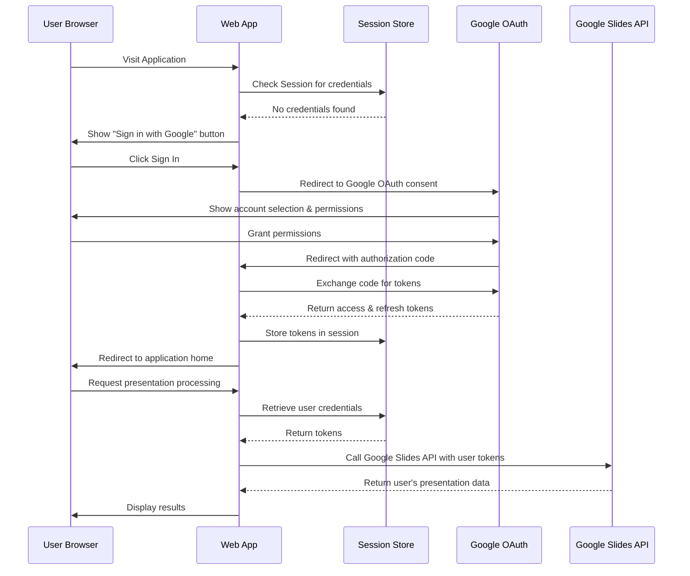
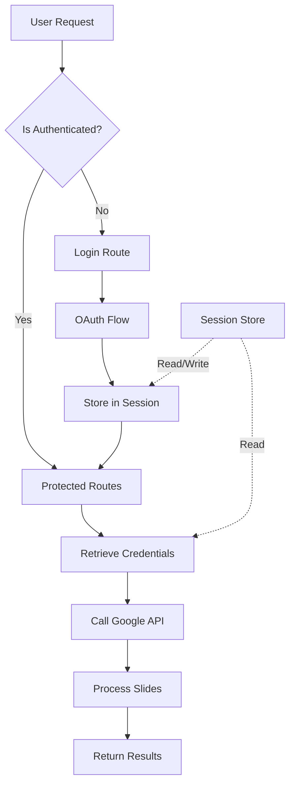

# Google API User Authentication Setup

## Problem Statement

The application currently uses a single shared Google OAuth token stored in the file system. When accessed through incognito mode or by different users, the application continues using the same Google account credentials, preventing users from accessing their own Google Slides.

### Current Behavior
- Single OAuth token stored in `credentials/token.json`
- All users share the same Google account access
- File-based `OAuthManager` used for background operations
- `WebOAuthManager` exists but is not integrated into the authentication flow

### Desired Behavior
- Each user authenticates with their own Google account
- User sees "Sign in with Google" button on first visit
- OAuth tokens stored per-user in session or database
- Users can only access their own Google Slides
- Multiple users can use the system simultaneously with different accounts

## Solution Overview

Transform the application from single-user shared authentication to multi-user per-session authentication by implementing a complete OAuth flow that requires each user to authenticate with their Google account.

## Architecture

### Authentication Flow

### Component Interaction

## Design Components

### 1. Authentication Routes

| Route | Method | Purpose | Authentication |
|-------|--------|---------|----------------|
| `/login` | GET | Display login page or redirect to OAuth | Public |
| `/auth/google` | GET | Initiate OAuth flow with Google | Public |
| `/auth/callback` | GET | Handle OAuth callback and store credentials | Public |
| `/logout` | GET | Clear session credentials | Authenticated |
| `/` | GET | Main application page | Authenticated |
| `/process` | POST | Process presentation | Authenticated |
| `/slide_editor` | GET | Edit slides | Authenticated |

### 2. Session Management

#### Session Data Structure

| Field | Type | Purpose |
|-------|------|---------|
| `credentials` | Object | OAuth token data |
| `credentials.token` | String | Current access token |
| `credentials.refresh_token` | String | Refresh token for obtaining new access tokens |
| `credentials.token_uri` | String | Google token endpoint |
| `credentials.client_id` | String | OAuth client ID |
| `credentials.client_secret` | String | OAuth client secret |
| `credentials.scopes` | Array | Authorized scopes |
| `oauth_state` | String | CSRF protection state parameter |
| `user_email` | String | User's Google account email (optional) |

#### Session Storage Options

**Option A: Flask Session (Server-side)**
- Store encrypted session data in cookies
- Requires `Flask-Session` extension
- Session data stored in Redis, database, or file system
- Recommended for production

**Option B: Secure Cookie Session**
- Store encrypted credentials in signed cookies
- Built-in Flask session with `SECRET_KEY`
- Suitable for development and small deployments
- Session size limited to 4KB

**Option C: Database-backed Sessions**
- Store credentials in database linked to session ID
- Most secure and scalable
- Requires database schema extension

### 3. Credential Storage Enhancement

#### Current Database Schema Extension

Add user-specific credential tracking to the existing database:

| Table | Field | Type | Purpose |
|-------|-------|------|---------|
| `user_sessions` | `session_id` | TEXT PRIMARY KEY | Unique session identifier |
| `user_sessions` | `user_email` | TEXT | User's Google account email |
| `user_sessions` | `credentials_json` | TEXT | Encrypted OAuth credentials |
| `user_sessions` | `created_at` | TIMESTAMP | Session creation time |
| `user_sessions` | `last_used_at` | TIMESTAMP | Last API call timestamp |
| `user_sessions` | `expires_at` | TIMESTAMP | Session expiration time |

#### Relationship to Existing Jobs Table

Link jobs to user sessions for access control:

| Field Addition | Type | Purpose |
|----------------|------|---------|
| `jobs.session_id` | TEXT | Foreign key to user_sessions |

### 4. Authentication Decorator

Protect routes requiring authentication:

**Behavior:**
- Check if session contains valid credentials
- If not authenticated, redirect to login page
- If token expired but refresh token exists, attempt refresh
- If refresh fails, redirect to login
- Store original requested URL for post-login redirect

**Applied to Routes:**
- All existing routes except `/login`, `/auth/google`, `/auth/callback`
- Index page `/`
- Processing endpoints `/process`, `/process_slides`
- Editor endpoint `/slide_editor`
- Job status endpoints

### 5. OAuth Configuration

#### Required Google Cloud Console Setup

**OAuth Consent Screen:**
- Application name: "AI Presentolog"
- User support email: Developer email
- Authorized domains: Application domain
- Scopes:
  - `https://www.googleapis.com/auth/presentations`
  - `https://www.googleapis.com/auth/presentations.readonly`
  - `https://www.googleapis.com/auth/drive.readonly`

**OAuth Client ID:**
- Application type: Web application
- Authorized redirect URIs:
  - `http://localhost:5000/auth/callback` (development)
  - `https://yourdomain.com/auth/callback` (production)

#### Environment Configuration

| Variable | Purpose | Example |
|----------|---------|---------|
| `GOOGLE_CLIENT_ID` | OAuth client ID | `xxx.apps.googleusercontent.com` |
| `GOOGLE_CLIENT_SECRET` | OAuth client secret | `GOCSPX-xxx` |
| `SECRET_KEY` | Flask session encryption | Random 32-byte string |
| `SESSION_TIMEOUT` | Session expiration (seconds) | `3600` (1 hour) |
| `OAUTHLIB_INSECURE_TRANSPORT` | Allow HTTP in dev (remove in prod) | `1` |

### 6. Integration with Existing Code

#### Modifications to Background Processing

Current background functions use file-based `OAuthManager`. Update to accept user credentials:

**Function Signature Change:**
- Pass credentials from session to background processing threads
- Functions accept credentials as parameter instead of initializing `OAuthManager`

**Affected Functions:**
- `extract_for_editor(job_id, presentation_url, credentials)`
- `process_slides_in_background(job_id, slides, template_name, existing_presentation_id, credentials)`

**Credential Passing Flow:**
1. Web route retrieves credentials from session
2. Serializes credentials to dictionary
3. Passes to background thread
4. Background thread reconstructs `Credentials` object
5. Uses credentials for API calls

#### WebOAuthManager Enhancement

Current `WebOAuthManager` provides core OAuth methods but needs integration:

**Current Methods:**
- `get_authorization_url()` - Generate OAuth URL
- `handle_oauth_callback()` - Process callback and store in session
- `get_credentials()` - Retrieve credentials from session with auto-refresh
- `is_authenticated()` - Check authentication status
- `logout()` - Clear session

**Enhancement Needed:**
- Add user info retrieval (email) after authentication
- Add credential validation on each request
- Add automatic refresh token handling
- Add error handling for revoked tokens

### 7. User Interface Updates

#### Login Page

**Elements:**
- Application logo and name
- Brief description of functionality
- "Sign in with Google" button (Google branding guidelines compliant)
- Privacy policy link
- Terms of service link

**User Experience:**
- Clean, minimal design
- Clear explanation of required permissions
- Trust indicators (SSL certificate, Google OAuth badge)

#### Navigation Bar Addition

Add to all authenticated pages:

**Elements:**
- User email or avatar (if available)
- Logout button
- Session status indicator

#### Error Pages

**Unauthorized Access (401):**
- Message: "Please sign in to continue"
- "Sign in with Google" button
- Link to home page

**Authentication Error:**
- Message: "Authentication failed. Please try again."
- Details of error (if safe to display)
- "Sign in again" button

**Session Expired:**
- Message: "Your session has expired"
- "Sign in again" button
- Note about unsaved work (if applicable)

## Security Considerations

### CSRF Protection

- Use `state` parameter in OAuth flow
- Validate state matches session on callback
- Generate cryptographically secure random state

### Token Storage

- Never expose tokens in client-side code
- Never log tokens
- Encrypt session data
- Use secure cookies (httpOnly, secure flags in production)

### Session Management

- Implement session timeout
- Regenerate session ID after login
- Clear session on logout
- Validate session on each request

### Access Control

- Users can only access their own jobs
- Filter database queries by session_id
- Validate job ownership before allowing edits

### Production Security Requirements

- Remove `OAUTHLIB_INSECURE_TRANSPORT=1`
- Enable HTTPS only
- Use environment variables for secrets
- Implement rate limiting on auth endpoints
- Add login attempt monitoring
- Implement CORS restrictions

## Error Handling

### Scenarios and Responses

| Scenario | Detection | User Response | System Action |
|----------|-----------|---------------|---------------|
| No credentials in session | Check on route access | Redirect to login | Store intended destination |
| Expired access token | API call fails with 401 | Transparent | Attempt refresh with refresh token |
| Refresh token expired | Refresh attempt fails | Redirect to login | Clear session, show message |
| Revoked access | API call returns 403 | Show error, redirect to login | Clear session |
| OAuth flow cancelled | Callback receives error | Show message | Return to login page |
| Invalid callback state | State mismatch | Show security error | Log incident, clear session |
| Network error during OAuth | HTTP timeout/error | Show error message | Allow retry |
| Concurrent session conflict | Multiple windows | Warning banner | Allow continued use |

### User Messaging

**Tone:** Clear, non-technical, actionable

**Examples:**
- "Please sign in with your Google account to continue"
- "Your session has expired. Please sign in again."
- "We couldn't connect to Google. Please check your internet and try again."
- "Access denied. Please ensure you've granted the required permissions."

## Migration Strategy

### Phase 1: Implement Authentication Infrastructure
- Set up OAuth routes
- Implement authentication decorator
- Update session handling
- Add user database schema

### Phase 2: Update Existing Routes
- Apply authentication decorator to routes
- Update background processing functions
- Pass credentials from session to workers
- Test with single user

### Phase 3: UI Integration
- Create login page
- Add logout functionality
- Update navigation
- Add user indicators

### Phase 4: Access Control
- Implement job ownership checks
- Filter queries by session
- Test multi-user scenarios

### Phase 5: Production Hardening
- Remove development-only settings
- Enable HTTPS enforcement
- Add rate limiting
- Implement monitoring
- Security audit

## Testing Requirements

### Authentication Flow Tests
- User can sign in with Google
- User receives appropriate scopes
- Credentials stored correctly in session
- Session persists across requests
- User can sign out
- Session cleared on logout

### Authorization Tests
- Unauthenticated users redirected to login
- Authenticated users can access protected routes
- Users cannot access other users' jobs
- Expired tokens automatically refreshed
- Revoked tokens trigger re-authentication

### Multi-User Tests
- Multiple users can sign in simultaneously
- Each user sees only their own presentations
- Session isolation maintained
- No credential leakage between users

### Error Recovery Tests
- Handle OAuth flow cancellation
- Handle network errors during authentication
- Handle expired refresh tokens
- Handle revoked access
- Handle invalid state parameters

## Rollback Plan

### Fallback to Single-User Mode

If multi-user authentication causes critical issues:

**Quick Rollback:**
- Disable authentication decorator
- Restore file-based `OAuthManager` usage
- Remove session credential checks
- Document issues encountered

**Data Preservation:**
- User sessions table can remain (not breaking)
- Jobs without session_id remain accessible
- No data loss during rollback

## Success Metrics

### Functional Success
- Users can authenticate with their own Google accounts
- Users can access only their own Google Slides
- Multiple concurrent users work without conflicts
- Sessions persist appropriately
- Token refresh works automatically

### Security Success
- No credential exposure in logs or client code
- CSRF protection functioning
- Session hijacking prevented
- Proper access control enforced

### User Experience Success
- Clear authentication flow
- Minimal friction to sign in
- Helpful error messages
- Seamless token refresh (invisible to user)
