# Persistent Work Sessions with Slide Data Recovery

## Overview

This design addresses the critical issue of session persistence in the slide editor application. Currently, user work is lost on page reload or server restart due to in-memory storage. The system must transition to durable storage while maintaining the existing localStorage-based editor functionality and adding backend synchronization.

## Problem Analysis

### Current State Issues

**In-Memory Job Storage**
- Job data stored in Python dictionary `jobs = {}` (web_app.py line 28)
- All session data lost when Flask server restarts
- No persistence across user sessions

**Missing Slides in Job Storage**
- Extraction process (`extract_for_editor`) stores slides in `jobs[job_id]['slides']` 
- Processing route (`process_slides`) does NOT store slides field in job object (lines 264-274)
- When navigating via `/slide_editor?job_id=XXX`, backend may have empty slides array

**Client-Only Persistence**
- Slides persisted only in browser localStorage via `saveSlides()` function
- No synchronization with backend
- Risk of data loss if localStorage is cleared or quota exceeded

**Error on Page Reload**
- User reports error message: "❌Ошибка - Произошла ошибка при обработке"
- Empty editor after reload
- No work history after server restart

## Strategic Goals

1. **Durable Storage**: Persist all user work to survive server restarts
2. **Data Recovery**: Restore complete slide state from backend
3. **Auto-Save**: Reduce data loss risk through periodic backend synchronization
4. **Work History**: Enable users to access previous sessions
5. **Hybrid Approach**: Keep localStorage as local cache while adding backend persistence

## Solution Architecture

### Storage Strategy

**Database Selection**: SQLite
- Already used by Rails app (db/schema.rb exists)
- Lightweight, file-based, no additional setup
- Sufficient for single-user/small team scenarios
- JSON support for complex data structures

**Data Model**: Jobs Table
- Extend existing job tracking concept
- Store slides as JSON text column
- Include presentation settings
- Track timestamps for history and cleanup

### Data Flow Design

```mermaid
graph TB
    A[User Edits Slides] --> B[Update localStorage]
    A --> C[Trigger Auto-Save Timer]
    C --> D[POST /api/save_slides]
    D --> E[SQLite Database]
    
    F[Page Load/Reload] --> G[GET /api/load_slides]
    G --> E
    G --> H{Data Found?}
    H -->|Yes| I[Load from Backend]
    H -->|No| J[Fallback to localStorage]
    I --> K[Merge with localStorage]
    J --> K
    K --> L[Render Slide Editor]
    
    M[Server Restart] --> E
    E --> N[Data Persists]
```



## Data Model

### Jobs Table Schema

| Column | Type | Constraints | Purpose |
|--------|------|-------------|---------|
| id | TEXT | PRIMARY KEY | Job identifier (UUID short form) |
| presentation_url | TEXT | | Original Google Slides URL |
| template | TEXT | NULLABLE | Template name (optional) |
| status | TEXT | | Job status: extracting, extracted, processing, completed, error |
| created_at | TIMESTAMP | NOT NULL | Job creation time |
| updated_at | TIMESTAMP | NOT NULL | Last modification time |
| slides_json | TEXT | NULLABLE | JSON-serialized slides array |
| settings_json | TEXT | NULLABLE | JSON-serialized presentation settings |
| generated_presentation_id | TEXT | NULLABLE | Google Slides ID of generated presentation |
| error | TEXT | NULLABLE | Error message if status=error |

### Slides JSON Structure

Stored in `slides_json` column as JSON text:

```
[
  {
    "title": "Slide Title",
    "mainText": "Main content...",
    "secondaryText": "Footer text",
    "fontFamily": "Arial",
    "titleSize": 44,
    "textSize": 18,
    "textPosition": {
      "vertical": "top",
      "horizontal": "left"
    },
    "images": [
      {
        "src": "data:image/png;base64,...",
        "x": 100,
        "y": 150,
        "width": 200,
        "height": 150,
        "layer": "background"
      }
    ],
    "tables": [...],
    "arrows": [...],
    "original_objectIds": ["id1", "id2"]
  }
]
```

### Settings JSON Structure

Stored in `settings_json` column:

```
{
  "pageOrientation": "horizontal",
  "defaultFont": "Arial",
  "defaultFontSize": 18,
  "defaultTextPosition": {
    "vertical": "top",
    "horizontal": "left"
  }
}
```

## API Design

### Save Slides Endpoint

**Route**: `POST /api/save_slides`

**Request Body**:
```
{
  "job_id": "abc12345",
  "slides": [...],
  "settings": {...}
}
```

**Response** (Success):
```
{
  "status": "saved",
  "timestamp": "2025-12-07T16:30:00",
  "slides_count": 5
}
```

**Response** (Error):
```
{
  "error": "Job not found"
}
```

**Behavior**:
- Validate job_id exists
- Serialize slides and settings to JSON
- Update database: `slides_json`, `settings_json`, `updated_at`
- Return success with timestamp

**Error Handling**:
- 404: Job not found
- 400: Invalid JSON or missing required fields
- 500: Database write failure

---

### Load Slides Endpoint

**Route**: `GET /api/load_slides?job_id={job_id}`

**Response** (Success):
```
{
  "slides": [...],
  "settings": {...},
  "last_updated": "2025-12-07T16:30:00",
  "status": "extracted"
}
```

**Response** (No Data):
```
{
  "slides": [],
  "settings": null,
  "message": "No saved slides found"
}
```

**Behavior**:
- Query database for job by ID
- Deserialize `slides_json` and `settings_json`
- Return parsed data with metadata

---

### Job Status Endpoint Enhancement

**Route**: `GET /api/job/{job_id}` (existing)

**Enhanced Response**:
```
{
  "id": "abc12345",
  "url": "https://docs.google.com/...",
  "status": "extracted",
  "created_at": "2025-12-07T16:00:00",
  "updated_at": "2025-12-07T16:30:00",
  "slides_count": 5,
  "has_slides": true,
  "generated_presentation_id": "..."
}
```

**Changes**:
- Add `slides_count` field (length of slides array)
- Add `has_slides` boolean flag
- Add `updated_at` timestamp

## Frontend Integration

### Auto-Save Mechanism

**Timer-Based Save**:
- Interval: 30 seconds
- Triggered only if slides exist and have changes
- Debounced to prevent excessive API calls

**Event-Based Save**:
Trigger immediate save on:
- Add/delete slide
- Image upload
- Table/arrow creation
- Settings change

**Implementation Pattern**:
```
let saveTimer = null;
let pendingSave = false;

function triggerAutoSave() {
  pendingSave = true;
  
  if (saveTimer) {
    clearTimeout(saveTimer);
  }
  
  saveTimer = setTimeout(() => {
    if (pendingSave) {
      saveToBackend();
      pendingSave = false;
    }
  }, 30000); // 30 seconds
}

async function saveToBackend() {
  // Save current slide state to memory
  saveCurrentSlide();
  
  // Send to backend
  const response = await fetch('/api/save_slides', {
    method: 'POST',
    headers: {'Content-Type': 'application/json'},
    body: JSON.stringify({
      job_id: jobId,
      slides: slides,
      settings: presentationSettings
    })
  });
  
  if (response.ok) {
    updateLastSavedIndicator();
  }
}
```

### Load on Initialization

**Load Strategy**:
1. Attempt to load from backend via `/api/load_slides`
2. If backend returns data, merge with localStorage (prefer localStorage if newer)
3. If backend fails or returns empty, use localStorage only
4. Show warning if falling back to localStorage

**Implementation Pattern**:
```
async function loadFromBackend() {
  if (!jobId || jobId === 'default') return null;
  
  try {
    const response = await fetch(`/api/load_slides?job_id=${jobId}`);
    if (response.ok) {
      const data = await response.json();
      return data;
    }
  } catch (error) {
    console.error('Failed to load from backend:', error);
  }
  return null;
}

async function initializeSlideData() {
  const backendData = await loadFromBackend();
  const localData = loadSlidesFromStorage();
  
  if (backendData && backendData.slides && backendData.slides.length > 0) {
    // Compare timestamps if available
    const backendTime = new Date(backendData.last_updated);
    const localTime = localStorage.getItem(`${jobId}_slides_timestamp`);
    
    if (localTime && new Date(localTime) > backendTime) {
      // localStorage is newer, use it but show merge option
      showMergeDialog(localData, backendData);
    } else {
      // Backend is authoritative
      slides = backendData.slides;
      presentationSettings = backendData.settings || presentationSettings;
    }
  } else if (localData && localData.length > 0) {
    // Fallback to localStorage
    showLocalStorageFallbackWarning();
    slides = localData;
  }
  
  // Save timestamp
  localStorage.setItem(`${jobId}_slides_timestamp`, new Date().toISOString());
}
```

### UI Indicators

**Last Saved Indicator**:
- Position: Top-right of editor, near action buttons
- Format: "Last saved: 2 minutes ago" or "Saving..." or "All changes saved"
- Color: Green when saved, yellow when pending, red on error

**Manual Save Button**:
- Text: "💾 Save Now"
- Position: Next to last saved indicator
- Behavior: Immediately trigger saveToBackend()

**Storage Warning**:
- Show banner when falling back to localStorage: "⚠️ Loaded from local cache - server data unavailable"
- Allow user to retry backend load

## Backend Implementation

### Database Setup

**Migration Script** (Python/Flask):
- Create SQLite database file in `db/` directory
- Execute schema creation SQL
- Initialize connection pool

**Database Connection**:
- Use SQLite3 library (built-in Python)
- Connection string: `sqlite:///db/presentation_jobs.db`
- Enable JSON1 extension for JSON queries (if needed)

### Route Modifications

**1. Extraction Route** (`extract_for_editor` function)
- After extraction completes (line 156-159)
- CHANGE: Write slides to database in addition to in-memory dict
- ACTION: Call `save_job_to_db(job_id, jobs[job_id])`

**2. Slide Editor Route** (`/slide_editor` line 188)
- CHANGE: Load slides from database if not in memory
- ACTION: If `job not in jobs`, call `load_job_from_db(job_id)`
- Fallback to in-memory if database load fails

**3. Process Slides Route** (`/process_slides` line 253)
- ADD: Store slides in job object (currently missing)
- CHANGE: Persist to database when job is created
- ACTION: Add `jobs[job_id]['slides'] = slides` and save to DB

**4. New Routes**:
- `/api/save_slides` (POST): Save slides and settings to database
- `/api/load_slides` (GET): Load slides and settings from database
- `/history` enhancement: Query database for all jobs with metadata

### Database Helper Functions

**save_job_to_db(job_id, job_data)**:
- Serialize `slides` and `settings` to JSON strings
- INSERT or UPDATE job record in database
- Set `updated_at` timestamp

**load_job_from_db(job_id)**:
- Query database for job by ID
- Deserialize JSON fields
- Return job dictionary or None if not found

**list_all_jobs(limit=50, offset=0)**:
- Query database for jobs ordered by `created_at DESC`
- Return list of job summaries (without full slides data)
- Support pagination

**cleanup_old_jobs(days=30)**:
- DELETE jobs where `created_at < NOW() - {days} days`
- Run on application startup or scheduled task

## Work History Page

### Enhancement Strategy

**Current State** (`/history` route, line 382):
- Displays jobs from in-memory dictionary
- Sorted by `created_at` descending

**Enhancements**:
- Load jobs from database instead of memory
- Add pagination (50 jobs per page)
- Display thumbnails: first slide title or preview text
- Show status badges: In Progress, Completed, Error
- Add "Resume Editing" link to `/slide_editor?job_id={id}`
- Display timestamps: "Created 2 hours ago", "Last updated 30 minutes ago"

### UI Mockup Structure

| Thumbnail | Job Info | Actions |
|-----------|----------|---------|
| [Preview Text] | Title: Job abc12345<br>Status: ✅ Extracted<br>Created: 2h ago<br>Updated: 30m ago | [Resume Editing] [Delete] |

## Conflict Resolution

### Scenarios

**Scenario 1: localStorage Newer**
- User edits offline, then comes online
- Backend has stale data
- Resolution: Show dialog offering to keep local, use server, or merge

**Scenario 2: Backend Newer**
- User opens editor on different device
- localStorage is empty or older
- Resolution: Automatically use backend data

**Scenario 3: Both Modified**
- Rare edge case with concurrent editing
- Resolution: Show side-by-side diff, let user choose

### Merge Dialog Design

**Dialog Content**:
- Title: "Conflicting Changes Detected"
- Message: "Your local work differs from the server. Choose an option:"
- Options:
  - **Keep Local**: Use your current edits (will overwrite server)
  - **Use Server**: Discard local changes and load from server
  - **Download Local Backup**: Save local data as JSON file before loading server data

**Implementation**:
- Detect conflict by comparing `updated_at` timestamps
- Show modal dialog with three buttons
- On choice, execute action and close dialog

## Edge Cases and Error Handling

### Edge Case: localStorage Quota Exceeded

**Detection**: Catch `QuotaExceededError` in saveSlides()

**Handling**:
1. Show warning: "⚠️ Local storage full. Saving to server only."
2. Disable localStorage writes
3. Rely solely on backend auto-save
4. Optionally compress image data URLs or move to backend storage

**Prevention**: Monitor localStorage usage, warn at 80% capacity

---

### Edge Case: Server Storage Full

**Detection**: Database write returns disk full error

**Handling**:
1. Return HTTP 507 (Insufficient Storage) from save endpoint
2. Show error: "❌ Server storage full. Contact administrator."
3. Prevent new job creation
4. Continue allowing edits (localStorage only)

---

### Edge Case: Corrupted JSON Data

**Detection**: JSON.parse() throws error when loading from database

**Handling**:
1. Log error with job_id and corrupted data
2. Return empty slides array with warning flag
3. Frontend shows: "⚠️ Could not load saved slides. Starting fresh."
4. Allow user to recover from localStorage if available

---

### Edge Case: Job ID Collision

**Prevention**: Use UUID version 4 with timestamp suffix
- Format: `{uuid4()[:8]}-{timestamp_ms}`
- Example: `a3f9b21c-1733587200123`
- Collision probability: negligible for reasonable scale

---

### Edge Case: Large Image Data URLs

**Detection**: Check data URL size before saving

**Handling**:
1. Limit: 5MB per image (base64-encoded)
2. Show warning: "⚠️ Image too large. Please use smaller file."
3. Reject upload, do not add to slide
4. Future enhancement: Upload to separate image storage (e.g., S3, local filesystem)

---

### Edge Case: Network Failure During Auto-Save

**Detection**: Fetch API throws network error

**Handling**:
1. Retry up to 3 times with exponential backoff (5s, 10s, 20s)
2. If all retries fail, show warning: "⚠️ Auto-save failed. Using local storage."
3. Queue failed save for retry on next user action
4. Highlight manual save button

## Migration Strategy

### Phase 1: Database Setup
- Create SQLite database schema
- Add database connection logic to web_app.py
- Implement save/load helper functions
- NO changes to user-facing routes yet

**Validation**: Database can store and retrieve job data

---

### Phase 2: Backend API Endpoints
- Implement `/api/save_slides` endpoint
- Implement `/api/load_slides` endpoint
- Update `/api/job/{job_id}` to include slides metadata
- Test with curl/Postman

**Validation**: Endpoints return correct data, handle errors gracefully

---

### Phase 3: Backend Route Integration
- Modify `extract_for_editor` to save to database
- Modify `/slide_editor` to load from database
- Modify `/process_slides` to save slides field
- Keep in-memory dict for backward compatibility

**Validation**: Editor loads slides from database after extraction

---

### Phase 4: Frontend Auto-Save
- Add auto-save timer logic to slide_editor.html
- Add last saved indicator UI
- Add manual save button
- Test localStorage fallback

**Validation**: Slides auto-save every 30 seconds, indicator updates

---

### Phase 5: Frontend Load Integration
- Add backend load logic to DOMContentLoaded
- Implement merge strategy with localStorage
- Add conflict resolution dialog
- Add warning banners

**Validation**: Editor loads from backend on page reload, merges with localStorage correctly

---

### Phase 6: Work History Enhancement
- Update `/history` route to query database
- Add pagination controls
- Add resume editing links
- Add delete job functionality

**Validation**: History page shows all jobs, allows resuming and deletion

---

### Phase 7: Cleanup and Optimization
- Implement old job cleanup task
- Add image size validation
- Add retry logic for failed saves
- Performance testing with 100+ jobs

**Validation**: System handles large datasets, cleans up old data

## Testing Strategy

### Unit Tests

**Database Layer**:
- Test save_job_to_db with valid data
- Test load_job_from_db with existing/non-existing ID
- Test JSON serialization/deserialization
- Test old job cleanup logic

**API Endpoints**:
- Test `/api/save_slides` with valid/invalid payloads
- Test `/api/load_slides` with existing/non-existing job_id
- Test error responses (404, 400, 500)

---

### Integration Tests

**End-to-End Flows**:
1. Extract presentation → Verify slides in database
2. Edit slides → Auto-save → Reload page → Verify data restored
3. Server restart → Verify data persists
4. Create job → Edit → Delete → Verify database cleanup

**Browser Testing**:
- Test in Chrome, Firefox, Edge
- Test localStorage quota handling
- Test offline/online transitions

---

### Manual Testing Checklist

- [ ] Extract presentation, verify slides saved to DB
- [ ] Edit slide, verify auto-save indicator updates
- [ ] Reload page, verify slides load from backend
- [ ] Clear localStorage, reload, verify backend fallback
- [ ] Restart Flask server, reload, verify data persists
- [ ] Create 50 jobs, verify history page pagination
- [ ] Edit on one device, open on another, verify sync
- [ ] Delete old jobs, verify database cleanup
- [ ] Upload large image, verify size warning
- [ ] Network offline, edit, go online, verify sync

## Success Criteria

| Criterion | Measurement |
|-----------|-------------|
| Data Persistence | User adds image, reloads page → image still present |
| Server Restart Recovery | User edits slides, server restarts → work recoverable from database |
| Navigation Recovery | User navigates to `/slide_editor?job_id=XXX` → full state restored from backend |
| Multi-User Support | Multiple users create jobs simultaneously → no conflicts |
| Work History | History page shows all sessions with status and timestamps |
| Auto-Save Effectiveness | Auto-save reduces data loss risk; indicator shows save status |
| Error Handling | System handles localStorage quota, server errors, network failures gracefully |

## Security Considerations

**Data Isolation**:
- Currently no authentication system
- All jobs accessible to anyone with job_id
- Future enhancement: Add user authentication and job ownership

**Input Validation**:
- Sanitize job_id to prevent SQL injection (use parameterized queries)
- Validate JSON structure before deserialization
- Limit request body size to prevent DoS (e.g., max 10MB)

**Data Privacy**:
- Slides may contain sensitive information
- Store database file with restricted filesystem permissions
- Consider encryption at rest for production

## Performance Considerations

**Database Indexing**:
- Create index on `created_at` for history queries
- Create index on `updated_at` for cleanup queries
- Monitor query performance with 1000+ jobs

**JSON Storage**:
- SQLite TEXT column can store up to 1GB
- Typical slide JSON size: 50KB - 500KB
- Expected capacity: 2000+ jobs before performance degradation

**Auto-Save Throttling**:
- Debounce to 500ms user input
- Batch saves every 30 seconds
- Prevent save during active editing (debounce)

**Image Data Optimization**:
- Compress images before base64 encoding
- Consider progressive enhancement: store thumbnails in JSON, full images separately
- Monitor database size growth

## Future Enhancements

**Multi-Device Sync**:
- Implement WebSocket for real-time sync
- Show "Another device is editing" warning
- Conflict-free replicated data types (CRDT) for collaborative editing

**Image Storage Service**:
- Move images from data URLs to filesystem or cloud storage
- Store only image references in database
- Reduce database size significantly

**User Authentication**:
- Add login system (OAuth or username/password)
- Associate jobs with user accounts
- Implement access control

**Export/Import**:
- Export job as JSON file for backup
- Import job from JSON file
- Share jobs between users

**Version History**:
- Track slide changes over time
- Allow reverting to previous versions
- Show diff between versions

## Deployment Notes

**Database Location**: 
- Development: `db/presentation_jobs.db` in project root
- Production: Configure path via environment variable

**Backup Strategy**:
- SQLite file can be backed up with simple file copy
- Recommend daily backups via cron job
- Cloud storage: copy to S3, Google Drive, etc.

**Environment Variables**:
- `DATABASE_PATH`: Override default database location
- `AUTO_SAVE_INTERVAL_MS`: Configure auto-save frequency (default: 30000)
- `JOB_CLEANUP_DAYS`: Days before old jobs are deleted (default: 30)

**Monitoring**:
- Log database write failures
- Alert on disk space warnings
- Track average save/load latency

## Dependencies

**Backend**:
- sqlite3 (Python built-in): Database access
- Flask (existing): Web framework
- json (Python built-in): JSON serialization

**Frontend**:
- Interact.js (existing): Image manipulation (already in use per memory)
- Fetch API (browser built-in): AJAX requests

**No New External Dependencies Required**

## Conclusion

This design provides a comprehensive strategy to transition the slide editor from ephemeral in-memory storage to persistent database storage while maintaining the existing localStorage-based workflow. The hybrid approach ensures data safety through backend persistence while preserving the responsiveness of client-side caching.

Key design decisions:
- SQLite for simplicity and zero-configuration
- JSON storage for flexibility with complex slide structures
- Auto-save with debouncing to balance UX and server load
- localStorage as primary edit cache, database as authoritative source
- Phased migration to minimize disruption

The implementation addresses all stated requirements, handles edge cases, and provides a foundation for future enhancements like multi-user collaboration and cloud sync.
