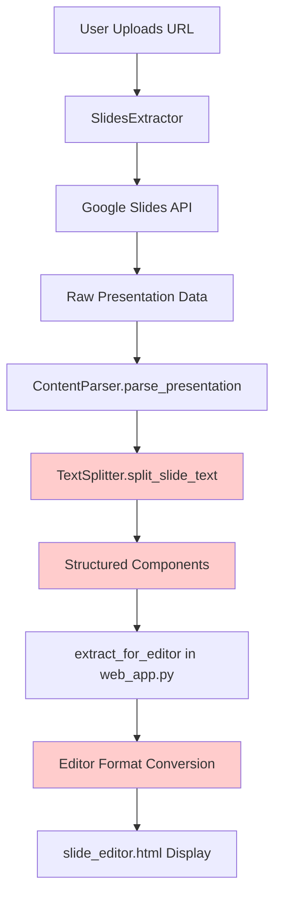
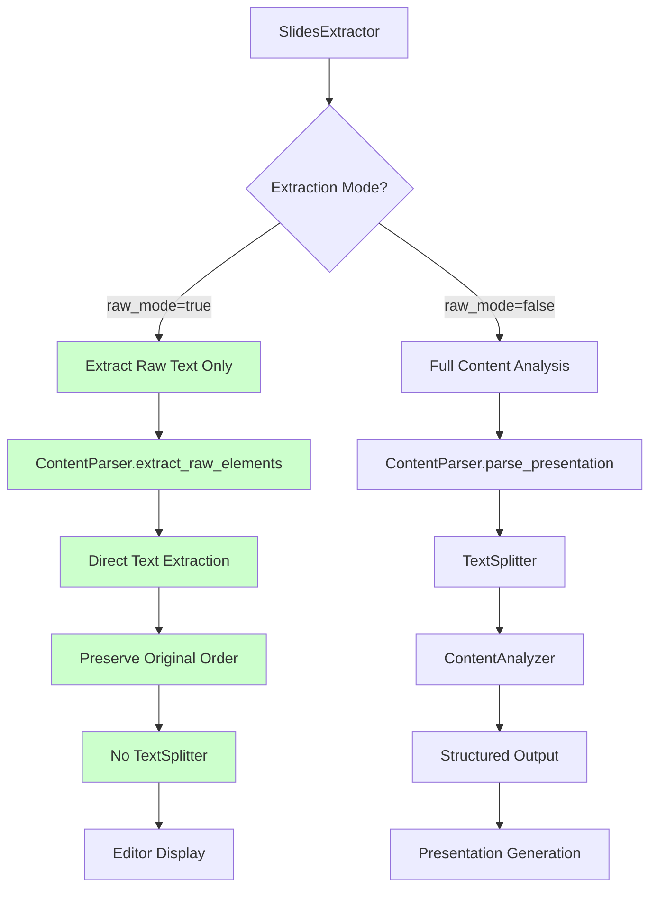
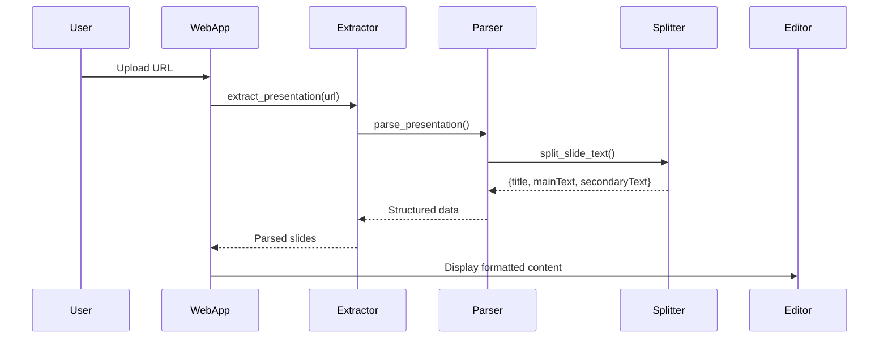
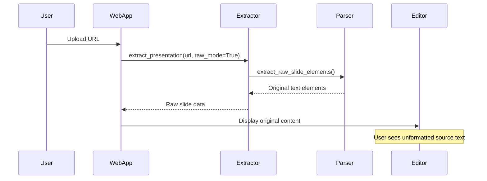

# Presentation Editor: Display Original Source Content

## Problem Statement

After uploading a presentation, the editor currently displays slides with pre-processed content that has been analyzed and structured by the extraction system. Users need to see the original, unformatted source text from the Google Slides presentation instead of the formatted/processed version.

**Current Behavior:**
- Content goes through TextSplitter and ContentAnalyzer
- Text is split into title/mainText/secondaryText based on smart formatting rules
- Original slide structure may be lost or reorganized

**Desired Behavior:**
- Display raw text exactly as it appears in source Google Slides
- No automatic formatting or restructuring
- Preserve original text order and structure
- Show all text elements from each slide without interpretation

## Current System Analysis

### Data Flow



**Problem Points:**
1. `TextSplitter.split_slide_text()` - Applies rules for title detection (≤6 words)
2. `ContentParser._extract_all_slide_text()` - Combines all text into single string
3. `extract_for_editor()` - Maps structured components to editor fields

### Current Code Locations

| Component | File | Lines | Function |
|-----------|------|-------|----------|
| Slide Extraction | `presentation_design/extraction/slides_extractor.py` | 80-121 | `extract_presentation()` |
| Content Parsing | `presentation_design/extraction/content_parser.py` | 26-54, 117-130 | `parse_presentation()`, `_extract_all_slide_text()` |
| Text Splitting | `presentation_design/extraction/text_splitter.py` | 30-88 | `split_slide_text()` |
| Editor Conversion | `web_app.py` | 87-161 | `extract_for_editor()` |
| Frontend Display | `templates/slide_editor.html` | 208-224 | `loadSlide()` |

## Design Solution

### Strategy

Create a **dual-mode extraction** system that preserves both:
1. **Raw Mode** - Original source text without processing (for editor display)
2. **Structured Mode** - Analyzed and formatted content (for final presentation generation)

### Architectural Changes



### Component Design

#### 1. ContentParser Enhancement

**New Method: `extract_raw_slide_elements()`**

Purpose: Extract text elements from a slide without any structural analysis or splitting.

Input:
- `slide_data` (Dict): Raw slide data from Google Slides API
- `index` (int): Slide position

Output:
- List of raw text elements with metadata:

| Field | Type | Description |
|-------|------|-------------|
| `type` | String | Always 'TEXT' |
| `content` | String | Exact text as extracted |
| `objectId` | String | Original element ID from API |
| `position_y` | Float | Vertical position for ordering |
| `placeholder_type` | String | Original placeholder type (TITLE/BODY/etc) |

Logic:
- Iterate through `pageElements` in slide data
- For each shape containing text:
  - Extract text via `textElements.textRun.content`
  - Preserve exact whitespace and line breaks
  - Record original position and placeholder metadata
  - Do NOT call TextSplitter
  - Do NOT apply content analysis
- Sort elements by vertical position (top to bottom)
- Return ordered list

#### 2. SlidesExtractor Enhancement

**Modified Method: `extract_presentation()`**

Add optional parameter:
- `raw_mode` (Boolean, default=False): When True, bypass content analysis

Behavior:
- If `raw_mode=False`: Use existing `ContentParser.parse_presentation()` flow
- If `raw_mode=True`: Use new `ContentParser.extract_raw_slide_elements()` for each slide

#### 3. Web Application Modification

**Modified Function: `extract_for_editor()` in web_app.py**

Current implementation:
```
extractor.extract_presentation(url)
→ parsed_data with structured components
→ map to editor_slide {title, mainText, secondaryText}
```

New implementation:
```
extractor.extract_presentation(url, raw_mode=True)
→ raw_data with original text elements
→ group elements by original placeholder type
→ map to editor fields based on source structure
```

Mapping Strategy:

| Source Placeholder Type | Target Editor Field |
|------------------------|---------------------|
| TITLE, CENTERED_TITLE | `title` |
| SUBTITLE | Append to `title` with newline |
| BODY, OBJECT | `mainText` |
| FOOTER | `secondaryText` |
| Unknown/Other | `mainText` (fallback) |

Ordering: Preserve top-to-bottom order within each field.

### Data Structure

#### Raw Slide Format

```
{
  "presentation_id": "abc123",
  "title": "Presentation Name",
  "slides": [
    {
      "index": 0,
      "slide_id": "slide_001",
      "raw_elements": [
        {
          "type": "TEXT",
          "content": "Original Title Text",
          "objectId": "elem_001",
          "position_y": 100.5,
          "placeholder_type": "TITLE"
        },
        {
          "type": "TEXT",
          "content": "Body text\nWith line breaks\nPreserved exactly",
          "objectId": "elem_002",
          "position_y": 200.8,
          "placeholder_type": "BODY"
        }
      ]
    }
  ]
}
```

#### Editor Slide Format (Updated)

```
{
  "title": "Original Title Text",
  "mainText": "Body text\nWith line breaks\nPreserved exactly",
  "secondaryText": "",
  "original_objectIds": ["elem_001", "elem_002"]
}
```

### User Interface Considerations

**No Changes Required** to `slide_editor.html`

The existing interface already supports:
- Plain text input fields
- Preserves line breaks in textarea
- Real-time preview with formatMainText()
- Manual editing by user

The change is transparent - editor receives different source data but displays it the same way.

### Workflow Comparison

#### Current (Structured) Workflow



#### New (Raw) Workflow



## Implementation Checklist

### Phase 1: Core Extraction (Raw Mode)

1. **ContentParser Enhancement**
   - Add `extract_raw_slide_elements()` static method
   - Extract text from pageElements without analysis
   - Preserve original placeholder types and positions
   - Sort by vertical position
   - Return raw element list

2. **SlidesExtractor Modification**
   - Add `raw_mode` parameter to `extract_presentation()`
   - Add conditional logic: if raw_mode, use raw extraction
   - Update return structure to include raw_elements field

### Phase 2: Web Application Integration

3. **extract_for_editor() Function**
   - Call extractor with `raw_mode=True`
   - Implement new mapping logic from raw_elements to editor format
   - Group by placeholder_type
   - Preserve text order within groups
   - Handle edge cases (missing placeholders, multiple titles)

4. **Testing**
   - Test with various slide structures
   - Verify original text preservation
   - Confirm line breaks and whitespace maintained
   - Check ordering accuracy

### Phase 3: Backward Compatibility

5. **Dual Mode Support**
   - Keep existing structured extraction for presentation generation
   - Ensure `process_slides_in_background()` still uses structured mode
   - Maintain separation: raw mode for editor, structured mode for output

## Edge Cases & Handling

| Scenario | Handling Strategy |
|----------|------------------|
| Slide with no text | Return empty raw_elements list; editor shows empty fields |
| Multiple TITLE placeholders | Concatenate all titles with newline separator |
| Text boxes without placeholder type | Classify as BODY; append to mainText |
| Images/shapes (non-text) | Skip; focus only on text elements |
| Tables | Extract cell text in reading order (left-to-right, top-to-bottom) |
| Overlapping text boxes | Use vertical position for ordering; if same Y, use X position |
| Special characters/emojis | Preserve exactly as extracted from API |
| Multi-language content | No transformation; preserve original encoding |

## Validation Criteria

**Success Metrics:**

1. **Text Fidelity**
   - 100% match between Google Slides source and editor display
   - All line breaks preserved
   - All whitespace maintained
   - No text reordering (except grouping by role)

2. **User Experience**
   - Editor loads with original content visible immediately
   - User can see exactly what was in source presentation
   - Manual editing still works as before
   - Preview updates correctly

3. **System Integrity**
   - No breaking changes to existing presentation generation
   - Structured mode still available for final output
   - Backward compatible with current editor behavior

## Future Considerations

**Potential Enhancements:**

1. **Toggle Mode** - Allow users to switch between raw and structured view
2. **Diff Visualization** - Show what changed between original and structured
3. **Source Metadata Display** - Show placeholder types and positions in UI
4. **Undo to Original** - Reset edited slide back to raw source

These are NOT in scope for current implementation but may be valuable later.

## Technical Notes

**API Considerations:**
- Google Slides API returns text in `textElements.textRun.content`
- Line breaks are represented as `\n` characters
- Empty text runs may exist (tabs, bullets) - handle gracefully
- Position units are EMUs (English Metric Units): 914400 EMUs = 1 inch

**Performance:**
- Raw extraction should be faster than structured (no analysis overhead)
- No impact on presentation generation performance
- Job storage in memory unchanged

**Security:**
- No new security concerns
- Same OAuth flow
- Same data access patterns
