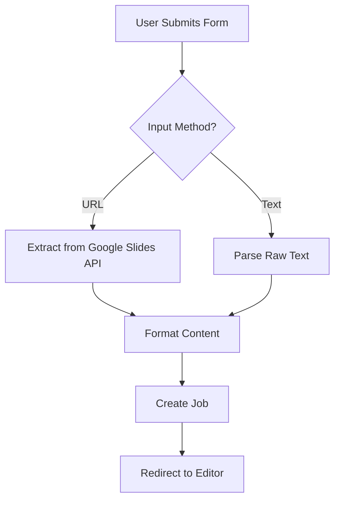
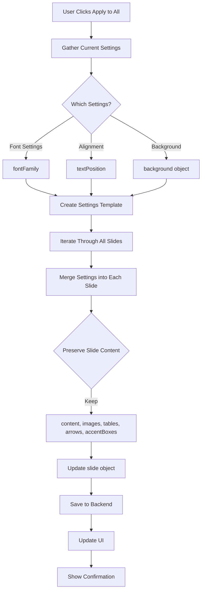
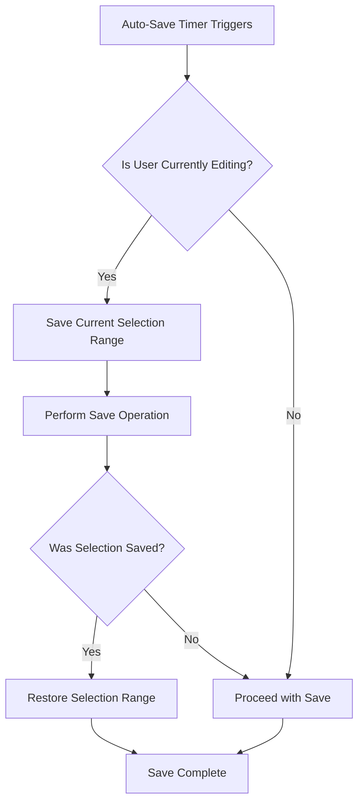
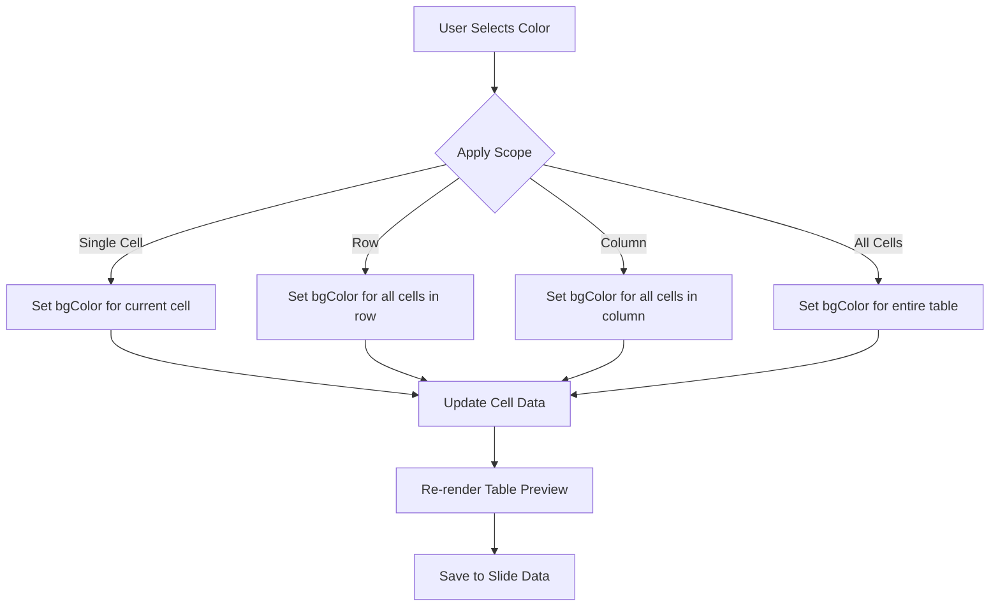
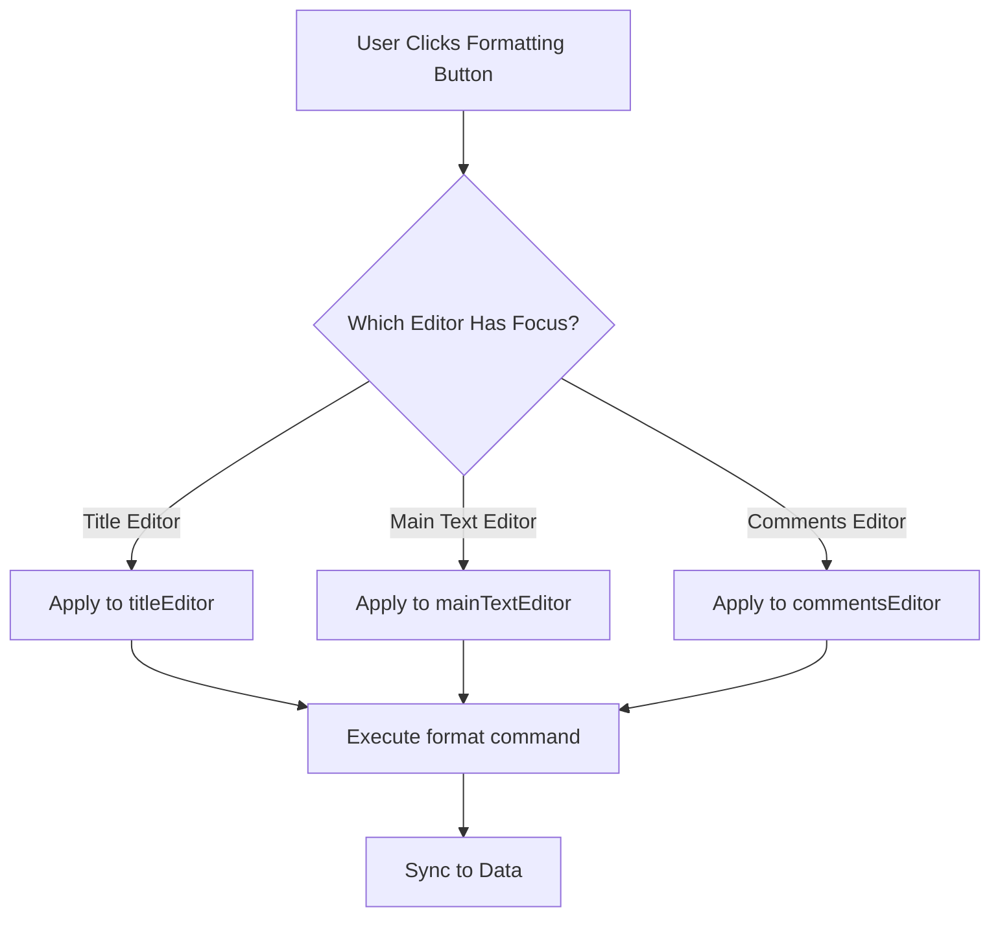
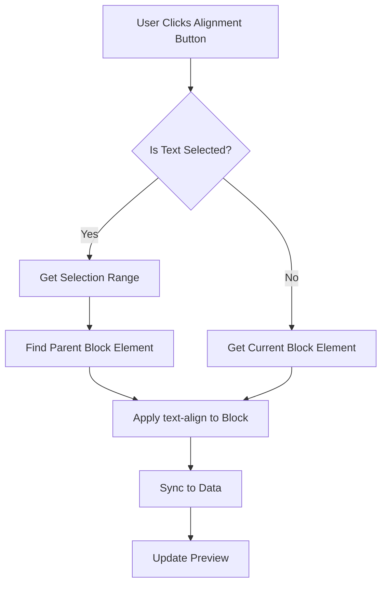

# Text Formatting Features and Application Fixes

## Overview

This document outlines the design for implementing automatic text formatting during presentation upload, fixing the "Apply to All" functionality, resolving text selection issues during auto-save, adding table background color customization, implementing separate editor blocks, fixing text alignment to work on selected fragments, and fixing arrow rendering with manipulation capabilities.

---

## 1. Automatic Text Formatting on Presentation Upload

### 1.1 Goal

When a user uploads text or imports a presentation, the application should automatically detect and format:
- Headings (based on text characteristics)
- Lists (bulleted and numbered)
- Emphasis (bold text)
- Text size hierarchy
- Create visually formatted slides instead of plain text

### 1.2 Input Methods

The main screen should provide two input options:

#### Option A: Google Slides URL
- User pastes link to existing Google Slides presentation
- System extracts content via Google Slides API
- Preserves original slide structure

#### Option B: Raw Text Input
- User pastes plain text directly into text area
- System parses text using formatting rules (see section 1.5)
- Automatically detects slide boundaries and formats content

**UI Layout on Main Screen:**

```
┌─────────────────────────────────────────────┐
│  Create New Presentation                    │
├─────────────────────────────────────────────┤
│                                             │
│  Choose Input Method:                       │
│                                             │
│  ○ Google Slides URL                        │
│  ○ Paste Text                               │
│                                             │
│  ┌─────────────────────────────────────┐   │
│  │ [Input area - changes based on      │   │
│  │  selection]                         │   │
│  │                                     │   │
│  │ If URL: Single line input           │   │
│  │ If Text: Multi-line textarea        │   │
│  └─────────────────────────────────────┘   │
│                                             │
│  [Process Button]                           │
└─────────────────────────────────────────────┘
```

**Implementation Location:** `templates/index.html`

**Current:** Single URL input field
```html
<input type="text" name="presentation_url" placeholder="Paste Google Slides URL">
```

**Updated:** Dual input with radio selection
```html
<div class="input-method-selector">
    <label>
        <input type="radio" name="input_method" value="url" checked>
        Google Slides URL
    </label>
    <label>
        <input type="radio" name="input_method" value="text">
        Paste Text
    </label>
</div>

<div id="urlInputContainer" class="input-container">
    <input type="text" name="presentation_url" placeholder="https://docs.google.com/presentation/d/...">
</div>

<div id="textInputContainer" class="input-container hidden">
    <textarea name="presentation_text" rows="15" 
              placeholder="Paste your text here...\n\nSlide 1\nTitle\nContent\n\nSlide 2\n..."></textarea>
</div>
```

**JavaScript Toggle Logic:**
```javascript
document.querySelectorAll('input[name="input_method"]').forEach(radio => {
    radio.addEventListener('change', (e) => {
        if (e.target.value === 'url') {
            document.getElementById('urlInputContainer').classList.remove('hidden');
            document.getElementById('textInputContainer').classList.add('hidden');
        } else {
            document.getElementById('urlInputContainer').classList.add('hidden');
            document.getElementById('textInputContainer').classList.remove('hidden');
        }
    });
});
```

### 1.3 Text Recognition Rules

#### Heading Detection Rules

| Criteria | Classification | Action |
|----------|---------------|---------|
| Line length ≤ 6 words | Title/Heading 1 | Apply H1 tag, larger font size (36-44pt) |
| Line length 7-15 words + ends with ":" | Heading 2 | Apply H2 tag, medium font size (24-32pt) |
| ALL CAPS text (3-50 chars) | Heading 3 | Apply H3 tag, convert to Title Case |
| Line starts with "# " | Heading 1 | Apply H1 tag (Markdown syntax) |
| Line starts with "## " | Heading 2 | Apply H2 tag (Markdown syntax) |
| Line starts with "### " | Heading 3 | Apply H3 tag (Markdown syntax) |
| Line length > 15 words | Main text | Apply paragraph tag, normal size (16-18pt) |

#### List Detection Rules

| Pattern | List Type | Marker Style |
|---------|-----------|--------------|
| Lines starting with "- ", "• ", "* " | Unordered list | Bullet point (•) |
| Lines starting with numbers "1. ", "2. " | Ordered list | Decimal numbering |
| Lines starting with "a) ", "b) " | Ordered list | Lower alpha (a, b, c) |
| Text with ":" followed by indented lines | Definition list | Bold heading + bulleted items |
| Consecutive similar patterns (3+ lines) | Auto-detect list | Apply appropriate list type |

#### Emphasis Detection Rules

| Pattern | Formatting | HTML Output |
|---------|-----------|-------------|
| Text between **text** or __text__ | Bold | `<strong>text</strong>` |
| Text between *text* or _text_ | Italic | `<em>text</em>` |
| Text between `text` | Code/monospace | `<code>text</code>` |
| Lines ending with ":" | Bold + List parent | `<strong>text:</strong><ul>` |

### 1.4 Backend Processing Flow

**File:** `web_app.py` - `/process` route (line 580)

**Current Flow:**
1. Receives `presentation_url` from form
2. Extracts content via Google Slides API
3. Redirects to editor

**Updated Flow:**


**Route Modification:**
```python
@app.route('/process', methods=['POST'])
@requires_auth
def process():
    input_method = request.form.get('input_method', 'url')
    
    if input_method == 'url':
        presentation_url = request.form.get('presentation_url')
        if not presentation_url:
            return jsonify({'error': 'Presentation URL is required'}), 400
        # Existing URL processing...
    elif input_method == 'text':
        raw_text = request.form.get('presentation_text')
        if not raw_text:
            return jsonify({'error': 'Text content is required'}), 400
        # New text processing...
        return process_raw_text(raw_text)
```

**New Function:**
```python
def process_raw_text(raw_text):
    """Process pasted text and create slides."""
    # Get credentials and session
    credentials = oauth_manager.get_credentials()
    session_id = get_session_id()
    
    # Create job
    job_id = str(uuid.uuid4())[:8]
    jobs[job_id] = {
        'id': job_id,
        'url': None,  # No URL for text input
        'status': 'parsing',
        'created_at': datetime.now().isoformat(),
        'session_id': session_id
    }
    
    # Parse text in background
    thread = threading.Thread(
        target=parse_text_for_editor,
        args=(job_id, raw_text)
    )
    thread.daemon = True
    thread.start()
    
    return redirect(url_for('extraction_status', job_id=job_id))
```

### 1.5 Parsing Algorithm Strategy

The parsing logic should be adapted from `index-7.html` (lines 572-1016) with modifications for Google Slides context:

#### Strategy 1: Number-Based Slide Detection
- Pattern: Text content followed by a number on a separate line
- Example: 
  ```
  Slide content here
  1
  
  Next slide content
  2
  ```
- Use regex: `/\n(\d+)\s*$/gm`

#### Strategy 2: Explicit Slide Markers
- Pattern: "Слайд N" or "Slide N" markers
- Example: `Слайд 1`, `Slide 2`
- Use regex: `/(?:^|\n)(слайд\s*(\d+))(?:\s+(.*))?/gi`

#### Strategy 3: Intelligent Block Analysis
- Analyze paragraph blocks separated by empty lines
- Classify blocks as:
  - Slide start markers
  - Titles (short, prominent text)
  - Main content
  - Secondary content

### 1.6 Text Parsing Function

**New Function:** `parse_text_for_editor(job_id, raw_text)`

**Location:** `web_app.py`

**Purpose:** Convert raw pasted text into formatted slide data

**Implementation:**
```python
def parse_text_for_editor(job_id, raw_text):
    """Parse raw text into formatted slides.
    
    Args:
        job_id: Job identifier
        raw_text: User-pasted text content
    """
    try:
        # Import parsing logic from index-7.html equivalent
        from presentation_design.extraction.text_parser import TextParser
        
        parser = TextParser()
        slides = parser.parse_slides(raw_text)
        
        # Convert to editor format
        editor_slides = []
        for slide in slides:
            editor_slide = {
                'title': slide.get('title', ''),
                'content': format_slide_content(slide),
                'mainText': '',  # Legacy compatibility
                'secondaryText': '',
                'original_objectIds': []
            }
            editor_slides.append(editor_slide)
        
        jobs[job_id]['status'] = 'extracted'
        jobs[job_id]['slides'] = editor_slides
        jobs[job_id]['completed_at'] = datetime.now().isoformat()
        
        # Save to database
        save_job_to_db(job_id, jobs[job_id])
        
    except Exception as e:
        print(f"Error parsing text: {e}")
        import traceback
        traceback.print_exc()
        jobs[job_id]['status'] = 'error'
        jobs[job_id]['error'] = str(e)
        save_job_to_db(job_id, jobs[job_id])

def format_slide_content(slide):
    """Format slide content with HTML tags.
    
    Args:
        slide: Parsed slide data with title, mainText, etc.
        
    Returns:
        Formatted HTML string
    """
    html_parts = []
    
    # Add title if present
    if slide.get('title'):
        html_parts.append(f"<h1>{slide['title']}</h1>")
    
    # Add main text with formatting
    main_text = slide.get('mainText', '')
    if main_text:
        # Convert special formatting:
        # **text** -> <strong>text</strong>
        main_text = re.sub(r'\*\*(.+?)\*\*', r'<strong>\1</strong>', main_text)
        # *text* -> <em>text</em>
        main_text = re.sub(r'\*(.+?)\*', r'<em>\1</em>', main_text)
        
        # Convert lists
        lines = main_text.split('\n')
        in_list = False
        for line in lines:
            line = line.strip()
            if not line:
                if in_list:
                    html_parts.append('</ul>')
                    in_list = False
                continue
            
            # Detect list items
            if line.startswith('• ') or line.startswith('- '):
                if not in_list:
                    html_parts.append('<ul>')
                    in_list = True
                html_parts.append(f"<li>{line[2:]}</li>")
            else:
                if in_list:
                    html_parts.append('</ul>')
                    in_list = False
                html_parts.append(f"<p>{line}</p>")
        
        if in_list:
            html_parts.append('</ul>')
    
    return '\n'.join(html_parts)
```

### 1.7 Formatting Workflow

```mermaid
flowchart TD
    A[User Pastes Text or Imports Presentation] --> B[Extract Raw Text Content]
    B --> C{Detect Slide Boundaries}
    C -->|Strategy 1| D[Number After Text]
    C -->|Strategy 2| E[Explicit Markers]
    C -->|Strategy 3| F[Intelligent Blocks]
    D --> G[For Each Slide]
    E --> G
    F --> G
    G --> H[Split Into Lines]
    H --> I{Analyze First Line}
    I -->|≤6 words| J[Apply Heading 1]
    I -->|>6 words| K[Apply to Main Text]
    J --> L[Process Remaining Lines]
    K --> L
    L --> M{Line Pattern Detection}
    M -->|Ends with ":"| N[Make Bold + Start List]
    M -->|Starts with bullet/number| O[Add List Item]
    M -->|Empty line after list| P[End List, Start Secondary Text]
    M -->|Regular text| Q[Add to Main Text]
    N --> R[Generate HTML]
    O --> R
    P --> R
    Q --> R
    R --> S[Store in slide.content]
```

### 1.8 Implementation Location

**File:** `web_app.py` - `extract_for_editor()` function (lines 632-738)

**Current Behavior:**
- Extracts all text in exact order
- Places everything in `mainText` field
- No formatting applied

**Required Changes:**
- After extracting `raw_elements`, apply formatting parser
- Split content into `title` and `content` fields
- Apply HTML formatting based on rules above
- Preserve lists, headings, and emphasis

**Processing Flow:**

```
1. Extract raw_elements from Google Slides (unchanged)
2. For each slide:
   a. Collect all text parts (unchanged)
   b. Apply parseSlides() function (from index-7.html)
   c. Detect headings, lists, emphasis
   d. Generate formatted HTML
   e. Store in editor_slide.content
3. Return formatted slides to editor
```

### 1.9 Font Size Mapping

| Element Type | Default Size (pt) | CSS Class |
|--------------|------------------|-----------|
| H1 (Title) | 36-44 | `text-4xl font-bold` |
| H2 (Subtitle) | 24-32 | `text-2xl font-semibold` |
| H3 (Section) | 20-24 | `text-xl font-semibold` |
| H4 (Subsection) | 18-20 | `text-lg font-medium` |
| Paragraph | 16-18 | `text-base` |
| List Item | 16-18 | `text-base` |
| Small Text | 12-14 | `text-sm` |

---

## 1A. Text Parser Module Implementation

### 1A.1 Overview

Create a new Python module to handle raw text parsing, adapting the JavaScript logic from `index-7.html` (lines 572-1016).

**Location:** `presentation_design/extraction/text_parser.py` (NEW FILE)

### 1A.2 Module Structure

```
presentation_design/
  extraction/
    __init__.py
    content_parser.py      (existing)
    slides_extractor.py    (existing)
    text_parser.py         (NEW)
    text_splitter.py       (existing)
```

### 1A.3 TextParser Class Design

**Class Responsibilities:**
- Detect slide boundaries in raw text
- Classify text blocks (titles, main text, lists)
- Apply formatting rules
- Generate structured slide data

**Key Methods:**

| Method | Purpose | Return Type |
|--------|---------|-------------|
| `parse_slides(text)` | Main entry point | `List[Dict]` |
| `detect_slide_boundaries(text)` | Find slide separators | `List[int]` |
| `classify_text_block(text)` | Identify block type | `str` |
| `format_list_items(lines)` | Convert to HTML list | `str` |
| `apply_emphasis(text)` | Apply bold/italic | `str` |
| `count_words(text)` | Count words in string | `int` |

### 1A.4 Slide Detection Strategies

Implement three strategies (same as index-7.html):

#### Strategy 1: Number After Text
**Pattern:** Text followed by standalone number
```python
import re

def detect_number_after_pattern(text):
    """
    Detect slides by numbers on separate lines after content.
    Example:
        Content here
        1
        
        More content
        2
    """
    pattern = r'\n(\d+)\s*$'
    matches = []
    for match in re.finditer(pattern, text, re.MULTILINE):
        matches.append({
            'number': match.group(1),
            'index': match.start(),
            'end': match.end()
        })
    return matches
```

#### Strategy 2: Explicit Markers
**Pattern:** "Slide N" or "Слайд N"
```python
def detect_slide_markers(text):
    """
    Detect explicit slide markers.
    Example: "Slide 1", "Слайд 2"
    """
    pattern = r'(?:^|\n)(slide|слайд)\s*(\d+)(?:\s+(.*))?'
    matches = []
    for match in re.finditer(pattern, text, re.IGNORECASE):
        matches.append({
            'number': match.group(2),
            'index': match.start(),
            'title_on_same_line': match.group(3)
        })
    return matches
```

#### Strategy 3: Intelligent Block Analysis
**Pattern:** Paragraph separation and content analysis
```python
def detect_intelligent_blocks(text):
    """
    Analyze text blocks separated by empty lines.
    Classify as titles, content, or slide breaks.
    """
    blocks = text.split('\n\n')
    slides = []
    current_slide = None
    
    for block in blocks:
        block = block.strip()
        if not block:
            continue
        
        lines = block.split('\n')
        first_line = lines[0].strip()
        word_count = len(first_line.split())
        
        # Detect if this starts a new slide
        if is_slide_start(first_line):
            if current_slide:
                slides.append(current_slide)
            current_slide = {'title': '', 'content': []}
        
        if not current_slide:
            current_slide = {'title': '', 'content': []}
        
        # Classify block
        if not current_slide['title'] and word_count <= 6:
            current_slide['title'] = first_line
            if len(lines) > 1:
                current_slide['content'].extend(lines[1:])
        else:
            current_slide['content'].extend(lines)
    
    if current_slide:
        slides.append(current_slide)
    
    return slides
```

### 1A.5 Text Formatting Functions

#### Word Counter
```python
def count_words(text: str) -> int:
    """Count words in text string."""
    return len(text.strip().split())
```

#### List Formatter
```python
def format_list_items(lines: List[str]) -> str:
    """Convert lines with colons and bullets to HTML lists."""
    html = []
    in_list = False
    
    for line in lines:
        stripped = line.strip()
        
        # Line ending with colon -> bold + start list
        if stripped.endswith(':'):
            if in_list:
                html.append('</ul>')
                in_list = False
            html.append(f'<strong>{stripped}</strong>')
            html.append('<ul>')
            in_list = True
            continue
        
        # List item
        if stripped.startswith(('• ', '- ', '* ')):
            if not in_list:
                html.append('<ul>')
                in_list = True
            html.append(f'<li>{stripped[2:]}</li>')
            continue
        
        # Empty line ends list
        if not stripped:
            if in_list:
                html.append('</ul>')
                in_list = False
            html.append('')
            continue
        
        # Regular line
        if in_list:
            html.append('</ul>')
            in_list = False
        html.append(f'<p>{stripped}</p>')
    
    if in_list:
        html.append('</ul>')
    
    return '\n'.join(html)
```

#### Emphasis Formatter
```python
def apply_emphasis(text: str) -> str:
    """Apply bold and italic formatting."""
    # **text** -> <strong>text</strong>
    text = re.sub(r'\*\*(.+?)\*\*', r'<strong>\1</strong>', text)
    # *text* -> <em>text</em>
    text = re.sub(r'\*(.+?)\*', r'<em>\1</em>', text)
    # __text__ -> <strong>text</strong>
    text = re.sub(r'__(.+?)__', r'<strong>\1</strong>', text)
    # _text_ -> <em>text</em>
    text = re.sub(r'_(.+?)_', r'<em>\1</em>', text)
    return text
```

### 1A.6 Complete TextParser Class

```python
import re
from typing import List, Dict, Optional

class TextParser:
    """Parse raw text into structured slide data."""
    
    def __init__(self):
        self.slides = []
    
    def parse_slides(self, text: str) -> List[Dict]:
        """Main parsing method.
        
        Args:
            text: Raw text input from user
            
        Returns:
            List of slide dictionaries
        """
        # Try strategy 1: Number after text
        matches = self.detect_number_after_pattern(text)
        if matches:
            return self.parse_number_after_slides(text, matches)
        
        # Try strategy 2: Explicit markers
        matches = self.detect_slide_markers(text)
        if matches:
            return self.parse_marked_slides(text, matches)
        
        # Fallback: Intelligent block analysis
        return self.detect_intelligent_blocks(text)
    
    def detect_number_after_pattern(self, text: str) -> List[Dict]:
        """Detect slides by number on separate line."""
        pattern = r'\n(\d+)\s*$'
        matches = []
        for match in re.finditer(pattern, text, re.MULTILINE):
            matches.append({
                'number': match.group(1),
                'index': match.start(),
                'end': match.end()
            })
        return matches
    
    def parse_number_after_slides(self, text: str, matches: List[Dict]) -> List[Dict]:
        """Parse slides when numbers follow content."""
        slides = []
        previous_end = 0
        
        for i, match in enumerate(matches):
            content = text[previous_end:match['index']].strip()
            if content:
                slide = self.create_slide_from_content(content, match['number'])
                slides.append(slide)
            previous_end = match['end']
        
        # Handle remaining text
        remaining = text[previous_end:].strip()
        if remaining:
            slide = self.create_slide_from_content(
                remaining, 
                str(len(slides) + 1)
            )
            slides.append(slide)
        
        return slides
    
    def create_slide_from_content(self, content: str, slide_id: str) -> Dict:
        """Create slide dictionary from text content."""
        lines = [l.strip() for l in content.split('\n')]
        
        title = ''
        main_text = ''
        
        if lines:
            first_line = lines[0]
            word_count = self.count_words(first_line)
            
            if word_count <= 6:
                title = first_line
                remaining_lines = lines[1:]
                main_text = self.format_content(remaining_lines)
            else:
                main_text = self.format_content(lines)
        
        return {
            'id': slide_id,
            'title': title,
            'mainText': main_text,
            'secondaryText': ''
        }
    
    def format_content(self, lines: List[str]) -> str:
        """Format lines into HTML content."""
        formatted = self.format_list_items(lines)
        formatted = self.apply_emphasis(formatted)
        return formatted
    
    def count_words(self, text: str) -> int:
        """Count words in text."""
        return len(text.strip().split())
    
    def format_list_items(self, lines: List[str]) -> str:
        """Format lists with HTML."""
        # Implementation from section 1A.5
        # ... (code from above)
        pass
    
    def apply_emphasis(self, text: str) -> str:
        """Apply emphasis formatting."""
        # Implementation from section 1A.5
        # ... (code from above)
        pass
    
    # Additional methods for other strategies...
```

### 1A.7 Integration with Web App

**Import in `web_app.py`:**
```python
from presentation_design.extraction.text_parser import TextParser

def parse_text_for_editor(job_id, raw_text):
    try:
        parser = TextParser()
        slides = parser.parse_slides(raw_text)
        
        # Convert to editor format...
        # (rest of implementation from section 1.6)
    except Exception as e:
        # Error handling...
```

---

## 2. Fix "Apply to All" Button Functionality

### 2.1 Problem Analysis

**Current Issues:**
- "Apply to All" button only applies `fontFamily` and `textPosition`
- Does NOT apply:
  - Background settings (color, gradient, image)
  - Font size
  - Text color
  - Images
  - Tables
  - Arrows
  - Accent boxes

**File:** `templates/slide_editor.html` - `applyToAll()` function (lines 1606-1625)

### 2.2 Settings to Apply

| Setting Category | Properties | Source Control |
|-----------------|-----------|----------------|
| **Font** | `fontFamily` | `#fontFamily` select |
| **Text Alignment** | `textPosition.vertical`, `textPosition.horizontal` | Alignment buttons |
| **Background** | `background.type`, `background.color`, `background.gradient`, `background.imageUrl` | Background section |
| **Page Orientation** | `pageOrientation` | `#pageOrientation` select |

### 2.3 Implementation Strategy

The function should:
1. Gather current slide's settings
2. Create a settings object with all applicable properties
3. Apply to all slides in the `slides` array
4. Exclude content-specific items (images, tables, arrows, text content)
5. Preserve each slide's unique content

### 2.4 Settings Application Logic



### 2.5 Exclusion Rules

**DO NOT apply to all:**
- `content` - Each slide's text content
- `images` - Slide-specific images
- `tables` - Slide-specific tables
- `arrows` - Slide-specific arrows
- `accentBoxes` - Slide-specific accent boxes
- `title`, `mainText`, `secondaryText` - Legacy content fields

**DO apply to all:**
- `fontFamily` - Font selection
- `textPosition` - Text alignment (vertical + horizontal)
- `background` - Background type, colors, gradient, image
- Orientation settings if present

### 2.6 Updated Function Structure

```javascript
function applyToAll() {
    // Gather current slide settings
    const currentSlide = slides[currentSlideIndex];
    const settingsTemplate = {
        fontFamily: document.getElementById('fontFamily').value,
        textPosition: { ...presentationSettings.defaultTextPosition },
        background: currentSlide.background ? { ...currentSlide.background } : { type: 'none', color: '#FFFFFF' }
    };
    
    // Apply to all slides
    slides = slides.map(slide => ({
        ...slide,                    // Keep all existing properties
        fontFamily: settingsTemplate.fontFamily,
        textPosition: {...settingsTemplate.textPosition},
        background: {...settingsTemplate.background}
        // Explicitly preserve content, images, tables, arrows, accentBoxes
    }));
    
    // Save and update
    saveToBackend();
    updateSlidePreview();
    alert('Settings applied to all slides!');
}
```

---

## 3. Fix Text Selection Loss During Auto-Save

### 3.1 Problem Description

**Current Behavior:**
- Auto-save triggers every 30 seconds
- When saving, text selection in contenteditable is lost
- Makes it difficult to apply formatting (bold, size, color) to selected text
- User must re-select text after each auto-save

**Affected Area:** Auto-save mechanism + contenteditable interactions

### 3.2 Root Cause Analysis

The selection is lost because:
1. Auto-save triggers `saveCurrentSlide()` which modifies the slide object
2. Slide modification may trigger React-like updates or DOM manipulation
3. DOM updates cause the browser to lose the current selection range
4. The `contenteditable` element loses focus or its selection state is reset

### 3.3 Solution Strategy

Implement **selection preservation** during save operations:

#### Selection Preservation Workflow



### 3.4 Implementation Approach

**Technique:** Save and restore selection using Range API

**Key Functions:**

| Function | Purpose | Trigger |
|----------|---------|---------|
| `saveSelection()` | Captures current selection range | Before formatting operations |
| `restoreSelection()` | Restores saved selection range | After formatting operations |
| `preserveSelectionDuringSave()` | Wraps save with selection preservation | During auto-save |

### 3.5 Selection Preservation Code Pattern

```javascript
let savedSelection = null;

function saveSelection() {
    const selection = window.getSelection();
    if (selection.rangeCount > 0) {
        savedSelection = selection.getRangeAt(0);
    }
}

function restoreSelection() {
    if (savedSelection) {
        const selection = window.getSelection();
        selection.removeAllRanges();
        selection.addRange(savedSelection);
    }
}

function autoSaveWithSelectionPreservation() {
    // Save current selection
    saveSelection();
    
    // Perform save
    saveToBackend();
    
    // Restore selection after save completes
    setTimeout(() => {
        restoreSelection();
    }, 50); // Small delay to ensure DOM updates complete
}
```

### 3.6 Integration Points

**File:** `templates/slide_editor.html`

**Locations to Modify:**

1. **Auto-save function** (line ~1785-1820):
   - Wrap save logic with selection preservation
   
2. **Formatting toolbar handlers** (line ~558-600):
   - Already has `onmousedown="saveSelection()"` on some buttons
   - Ensure all formatting buttons save selection first

3. **Font size slider** (line ~653-660):
   - Already has `onmousedown="saveSelection()"`
   - Ensure `oninput` handler preserves selection

### 3.7 Additional Considerations

**Focus Management:**
- Ensure `contenteditable` element retains focus during save
- Prevent focus loss to other UI elements

**Debouncing:**
- Only trigger auto-save if no formatting operation is in progress
- Add flag: `isFormattingInProgress`

**Save Trigger Optimization:**
- Don't trigger save on every keystroke
- Use debounced save (wait 2-3 seconds after last edit)

---

## 4. Add Table Background Color Customization

### 4.1 Goal

Allow users to set background fill color for table cells in the table editor.

### 4.2 Current Table Structure

**Data Model:**
```javascript
{
    id: 'table_xxx',
    position: { x: 50, y: 200 },
    size: { width: 500, height: 200 },
    rows: 3,
    columns: 3,
    cellData: [
        [{ text: 'Cell 1-1', bgColor: '#FFFFFF' }, ...]
    ]
}
```

**UI Location:** Table Cell Editor Modal (`#tableCellEditorModal`)

### 4.3 Required UI Changes

Add background color picker to cell editor modal:

| Control | Type | Label | Default Value |
|---------|------|-------|---------------|
| Background Color Picker | `<input type="color">` | "Фон ячейки" | `#FFFFFF` (white) |
| Apply to Row | Button | "Применить к строке" | - |
| Apply to Column | Button | "Применить к столбцу" | - |
| Apply to All | Button | "Применить ко всем" | - |

### 4.4 UI Layout in Modal

**Location:** Inside `#tableCellEditorModal` (line ~943-969)

**Add after cell grid, before save buttons:**

```
┌─────────────────────────────────────┐
│  Table Cell Editor                  │
├─────────────────────────────────────┤
│  + Row  + Column   [3x3 table]      │
│                                     │
│  [Cell content grid]                │
│                                     │
│  ┌───────────────────────────────┐  │
│  │ Background Color              │  │
│  │ [Color Picker: #FFFFFF]       │  │
│  │                               │  │
│  │ Apply to: [Row] [Column] [All]│  │
│  └───────────────────────────────┘  │
│                                     │
│  [Save] [Cancel]                    │
└─────────────────────────────────────┘
```

### 4.5 Cell Background Application Logic



### 4.6 Rendering Tables with Background

**File:** `templates/slide_editor.html` - `renderPreviewTables()` function

**Current rendering** creates `<table>` with cells:
```html
<td contenteditable="true">Cell text</td>
```

**Updated rendering** should apply inline styles:
```html
<td contenteditable="true" style="background-color: #FFFF00;">Cell text</td>
```

### 4.7 Data Structure Update

**Add to each cell in `cellData`:**
```javascript
{
    text: 'Cell content',
    bgColor: '#FFFFFF',      // NEW: Background color
    textColor: '#000000',    // Optional: Text color
    fontSize: 12,            // Optional: Font size
    bold: false,             // Optional: Bold
    italic: false            // Optional: Italic
}
```

### 4.8 Persistence

**Save to backend:** Include `bgColor` in table data when saving slides

**Load from backend:** Apply `bgColor` when rendering tables in preview

---

## 5. Separate Editor Blocks for Title, Main Text, and Comments

### 5.1 Goal

Replace the single `contenteditable` area with three separate editing blocks:
1. **Title Block** (top) - For slide titles/headings
2. **Main Text Block** (center) - For primary content
3. **Comments Block** (bottom) - For speaker notes/comments

Each block should have independent:
- Text formatting capabilities
- Font size controls
- Alignment options
- Full rich text editor toolbar

### 5.2 Current Structure

**File:** `templates/slide_editor.html` (line 604-616)

**Current:** Single `contenteditable` div
```html
<div id="editableContent" contenteditable="true" ...>
    <h1>Heading</h1>
    <p>Text...</p>
</div>
```

### 5.3 New Structure

**Replace with three separate blocks:**

```html
<div id="textLayerContainer" class="absolute inset-0 p-8 flex flex-col gap-4">
    <!-- Title Block -->
    <div class="title-block" style="min-height: 15%;">
        <div id="titleEditor" 
             contenteditable="true" 
             class="w-full h-full overflow-y-auto focus:outline-none border-b border-gray-200 pb-2"
             placeholder="Заголовок слайда..."
             oninput="syncTitleToData()">
        </div>
    </div>
    
    <!-- Main Text Block -->
    <div class="main-block flex-1" style="min-height: 60%;">
        <div id="mainTextEditor" 
             contenteditable="true" 
             class="w-full h-full overflow-y-auto focus:outline-none"
             placeholder="Основной текст..."
             oninput="syncMainTextToData()">
        </div>
    </div>
    
    <!-- Comments Block -->
    <div class="comments-block" style="min-height: 15%;">
        <div id="commentsEditor" 
             contenteditable="true" 
             class="w-full h-full overflow-y-auto focus:outline-none border-t border-gray-200 pt-2 text-sm text-gray-600"
             placeholder="Комментарии/заметки для слайда..."
             oninput="syncCommentsToData()">
        </div>
    </div>
</div>
```

### 5.4 Layout Distribution

```
┌─────────────────────────────────┐
│  [Title Editor - 15% height]    │ ← H1, H2 sizing, centered/left align
├─────────────────────────────────┤
│                                 │
│  [Main Text Editor - 60%]       │ ← Paragraphs, lists, formatting
│                                 │
│                                 │
├─────────────────────────────────┤
│  [Comments - 15% height]        │ ← Smaller text, speaker notes
└─────────────────────────────────┘
```

### 5.5 Toolbar Context Awareness

The formatting toolbar should detect which editor block is focused and apply formatting to that block only.

**Toolbar Behavior:**



### 5.6 Data Model Update

**Update slide data structure:**

```javascript
{
    titleContent: '<h1>Slide Title</h1>',        // NEW: Title HTML
    mainContent: '<p>Main text...</p>',          // RENAMED from 'content'
    commentsContent: '<p>Speaker notes...</p>',  // NEW: Comments HTML
    // ... other properties
}
```

### 5.7 Implementation Steps

1. **HTML Structure:**
   - Replace single `editableContent` with three editors
   - Add visual separators (borders)
   - Set flex layout with height percentages

2. **JavaScript Functions:**
   - `syncTitleToData()` - Save title content
   - `syncMainTextToData()` - Save main text content
   - `syncCommentsToData()` - Save comments content
   - `getActiveEditor()` - Detect which editor has focus

3. **Toolbar Integration:**
   - Modify all format functions to use `getActiveEditor()`
   - Ensure bold, italic, lists, etc. work on focused editor

4. **Loading Data:**
   - Split saved content into three blocks when loading
   - Detect headings for title, rest for main text

5. **Saving Data:**
   - Save all three fields separately
   - Send to backend as separate properties

---

## 6. Fix Text Alignment to Apply to Selected Fragment

### 6.1 Problem Description

**Current Behavior:**
- Text alignment buttons apply to entire text block
- Cannot align individual paragraphs or selected text

**Desired Behavior:**
- If text is selected → apply alignment to selection only
- If no selection → apply alignment to entire block

### 6.2 Current Implementation

**File:** `templates/slide_editor.html` - `changeTextPosition()` function

**Current Logic:**
- Sets alignment on the entire `editableContent` div
- Uses flex container alignment
- No per-paragraph alignment

### 6.3 Solution Strategy

Use CSS `text-align` on individual block elements instead of flex alignment on container.

#### Alignment Application Logic



### 6.4 Block Element Detection

**Target elements for alignment:**
- `<h1>`, `<h2>`, `<h3>`, `<h4>` - Headings
- `<p>` - Paragraphs
- `<li>` - List items (align within list)
- `<div>` - Generic blocks

**Alignment CSS:**
```css
text-align: left;
text-align: center;
text-align: right;
text-align: justify;
```

### 6.5 Implementation Approach

**Modify `changeTextPosition()` function:**

```javascript
function changeTextPosition(vertical, horizontal) {
    const editor = document.getElementById('editableContent');
    const selection = window.getSelection();
    
    if (horizontal) {
        if (selection.rangeCount > 0 && !selection.isCollapsed) {
            // Text is selected - apply to selection
            const range = selection.getRangeAt(0);
            let node = range.commonAncestorContainer;
            
            // Find parent block element
            while (node && node !== editor) {
                if (node.nodeType === Node.ELEMENT_NODE) {
                    const tag = node.tagName;
                    if (tag === 'P' || tag === 'H1' || tag === 'H2' || 
                        tag === 'H3' || tag === 'H4' || tag === 'LI' || tag === 'DIV') {
                        node.style.textAlign = horizontal;
                        break;
                    }
                }
                node = node.parentNode;
            }
        } else {
            // No selection - apply to all content
            editor.style.textAlign = horizontal;
        }
    }
    
    // Vertical alignment remains on container
    if (vertical) {
        const vAlignMap = { top: 'flex-start', center: 'center', bottom: 'flex-end' };
        editor.style.justifyContent = vAlignMap[vertical] || 'flex-start';
    }
    
    updateAlignmentButtons(vertical, horizontal);
    syncContentToData();
}
```

### 6.6 Alignment Button Indicator Update

**Update button state based on:**
- Current selection's alignment
- Or current cursor position's block alignment

**Modify `updateAlignmentButtons()` to detect current alignment:**

```javascript
function updateAlignmentButtons(vertical, horizontal) {
    // Detect alignment from selection if no values provided
    if (!horizontal) {
        const selection = window.getSelection();
        if (selection.rangeCount > 0) {
            let node = selection.anchorNode;
            while (node && node.nodeType !== Node.DOCUMENT_NODE) {
                if (node.nodeType === Node.ELEMENT_NODE && node.style.textAlign) {
                    horizontal = node.style.textAlign;
                    break;
                }
                node = node.parentNode;
            }
        }
    }
    
    // Update button styles...
}
```

---

## 7. Fix Arrow Rendering and Add Manipulation Capabilities

### 7.1 Problem Description

**Current Issues:**
1. Arrows appear in sidebar list but do NOT render on slide preview
2. Arrows lack resize/rotation handles like images
3. No visual customization options for arrow appearance

### 7.2 Current Arrow Data Model

**File:** `templates/slide_editor.html` - `addArrow()` function (line ~4040)

```javascript
{
    id: 'arrow_xxx',
    type: 'straight' | 'bent' | 'curved',
    start: { x: 100, y: 150 },
    end: { x: 300, y: 150 },
    color: '#000000',
    strokeWidth: 2
}
```

### 7.3 Missing Functionality

**Currently missing:**
- `renderPreviewArrows()` function - does NOT exist
- Arrow SVG rendering logic
- Arrow selection/manipulation handlers
- Arrow resize handles
- Arrow rotation capability

### 7.4 Arrow Rendering Implementation

#### Rendering Function Structure

```javascript
function renderPreviewArrows() {
    const arrows = slides[currentSlideIndex].arrows || [];
    const arrowsContainer = document.getElementById('previewArrows');
    
    // Clear existing arrows
    arrowsContainer.innerHTML = '';
    
    // Render each arrow as SVG
    arrows.forEach(arrow => {
        const arrowElement = createArrowSVG(arrow);
        arrowsContainer.appendChild(arrowElement);
    });
    
    // Initialize interactions
    if (typeof interact !== 'undefined') {
        initializeArrowInteractions();
    }
}
```

#### SVG Arrow Creation

```javascript
function createArrowSVG(arrowData) {
    const wrapper = document.createElement('div');
    wrapper.className = 'arrow-wrapper';
    wrapper.dataset.arrowId = arrowData.id;
    wrapper.style.pointerEvents = 'auto';
    wrapper.style.position = 'absolute';
    
    // Calculate bounding box
    const minX = Math.min(arrowData.start.x, arrowData.end.x);
    const minY = Math.min(arrowData.start.y, arrowData.end.y);
    const width = Math.abs(arrowData.end.x - arrowData.start.x);
    const height = Math.abs(arrowData.end.y - arrowData.start.y);
    
    wrapper.style.left = minX + 'px';
    wrapper.style.top = minY + 'px';
    wrapper.style.width = (width + 40) + 'px';  // +40 for padding
    wrapper.style.height = (height + 40) + 'px';
    
    // Create SVG
    const svg = document.createElementNS('http://www.w3.org/2000/svg', 'svg');
    svg.setAttribute('width', '100%');
    svg.setAttribute('height', '100%');
    svg.style.overflow = 'visible';
    
    // Create arrow path based on type
    const path = createArrowPath(arrowData);
    svg.appendChild(path);
    
    wrapper.appendChild(svg);
    
    // Add resize/rotation handles
    addArrowHandles(wrapper);
    
    return wrapper;
}
```

### 7.5 Arrow Path Types

#### Straight Arrow

```javascript
function createStraightArrowPath(start, end, color, strokeWidth) {
    const line = document.createElementNS('http://www.w3.org/2000/svg', 'line');
    line.setAttribute('x1', start.x);
    line.setAttribute('y1', start.y);
    line.setAttribute('x2', end.x);
    line.setAttribute('y2', end.y);
    line.setAttribute('stroke', color);
    line.setAttribute('stroke-width', strokeWidth);
    line.setAttribute('marker-end', 'url(#arrowhead)');
    return line;
}
```

#### Bent Arrow (L-shaped)

```javascript
function createBentArrowPath(start, end, color, strokeWidth) {
    const midX = (start.x + end.x) / 2;
    const pathData = `M ${start.x},${start.y} L ${midX},${start.y} L ${midX},${end.y} L ${end.x},${end.y}`;
    
    const path = document.createElementNS('http://www.w3.org/2000/svg', 'path');
    path.setAttribute('d', pathData);
    path.setAttribute('stroke', color);
    path.setAttribute('stroke-width', strokeWidth);
    path.setAttribute('fill', 'none');
    path.setAttribute('marker-end', 'url(#arrowhead)');
    return path;
}
```

#### Curved Arrow (Bezier)

```javascript
function createCurvedArrowPath(start, end, color, strokeWidth) {
    const controlX = (start.x + end.x) / 2;
    const controlY = start.y - 50; // Curve upward
    const pathData = `M ${start.x},${start.y} Q ${controlX},${controlY} ${end.x},${end.y}`;
    
    const path = document.createElementNS('http://www.w3.org/2000/svg', 'path');
    path.setAttribute('d', pathData);
    path.setAttribute('stroke', color);
    path.setAttribute('stroke-width', strokeWidth);
    path.setAttribute('fill', 'none');
    path.setAttribute('marker-end', 'url(#arrowhead)');
    return path;
}
```

### 7.6 Arrow Manipulation Handles

Add similar handles to images:

| Handle Type | Position | Functionality |
|-------------|----------|---------------|
| Start Point | Arrow start | Move start position |
| End Point | Arrow end | Move end position |
| Rotate Handle | Top center | Rotate entire arrow |
| Stroke Width Control | Sidebar | Adjust thickness |

### 7.7 Arrow Appearance Customization

Add to arrow modal and arrow editor:

| Property | Control Type | Options |
|----------|--------------|---------|
| Arrow Type | Select dropdown | Straight, Bent, Curved, Double-headed |
| Color | Color picker | Any hex color |
| Stroke Width | Range slider | 1-10 PT |
| Dash Style | Select dropdown | Solid, Dashed, Dotted |
| Arrowhead Style | Select dropdown | Triangle, Circle, Diamond, None |
| Opacity | Range slider | 0-100% |

### 7.8 Arrow Data Model Extension

**Updated structure:**

```javascript
{
    id: 'arrow_xxx',
    type: 'straight' | 'bent' | 'curved' | 'double',
    start: { x: 100, y: 150 },
    end: { x: 300, y: 150 },
    color: '#000000',
    strokeWidth: 2,
    dashStyle: 'solid' | 'dashed' | 'dotted',        // NEW
    arrowheadStyle: 'triangle' | 'circle' | 'diamond',  // NEW
    opacity: 1.0,                                      // NEW
    rotation: 0                                        // NEW
}
```

### 7.9 Integration with Slide Preview

**Add arrows container to slide preview:**

```html
<!-- In slide preview -->
<div id="slidePreview" ...>
    <!-- Existing layers -->
    <div id="textLayerContainer" style="z-index: 10;">...</div>
    <div id="previewImages" style="z-index: 20;">...</div>
    <div id="previewTables" style="z-index: 15;">...</div>
    
    <!-- NEW: Arrows layer -->
    <div id="previewArrows" class="absolute inset-0" style="z-index: 18; pointer-events: none;"></div>
    
    <div id="previewAccentBoxes" style="z-index: 12;">...</div>
</div>
```

**Call rendering function:**

```javascript
function updateSlidePreview() {
    updatePreviewStyles();
    renderPreviewArrows();  // NEW
}
```

---

## Implementation Priority

| Task | Priority | Complexity | Dependencies |
|------|----------|-----------|--------------|
| 1. Auto Text Formatting | High | Medium | None - independent |
| 2. Fix Apply to All | High | Low | None - bug fix |
| 3. Fix Text Selection Loss | High | Medium | Auto-save mechanism |
| 4. Table Background Color | Medium | Low | Table editor modal |
| 5. Separate Editor Blocks | Medium | High | Formatting toolbar refactor |
| 6. Text Alignment on Selection | Medium | Medium | Editor block structure |
| 7. Arrow Rendering & Manipulation | Low | High | SVG rendering, interaction handlers |

---

## Testing Scenarios

### Scenario 1: Text Formatting on Upload
1. User pastes text with various patterns (lists, headings, emphasis)
2. System detects and formats automatically
3. Verify headings, lists, bold text appear correctly

### Scenario 2: Apply to All
1. User sets background, font, alignment on slide 1
2. Clicks "Apply to All"
3. Verify all slides have same styling but different content

### Scenario 3: Selection Preservation
1. User selects text in editor
2. Auto-save triggers during selection
3. Verify selection remains after save completes

### Scenario 4: Table Background
1. User creates table
2. Edits table, sets cell background colors
3. Verify colors appear in preview and saved presentation

### Scenario 5: Separate Editors
1. User enters title, main text, comments
2. Applies formatting to each independently
3. Verify each block maintains its own formatting

### Scenario 6: Selective Alignment
1. User selects one paragraph
2. Applies center alignment
3. Verify only selected paragraph is centered

### Scenario 7: Arrow Rendering
1. User adds arrow to slide
2. Verifies arrow appears in preview
3. Resizes, rotates, changes color
4. Verifies changes persist in saved presentation

---

## Technical Constraints

- **Browser Compatibility:** Must work in Chrome, Firefox, Edge
- **Performance:** Auto-save should not cause UI lag
- **Data Persistence:** All changes must save to backend correctly
- **Backward Compatibility:** Existing presentations should load without errors
- **Undo/Redo:** Formatting operations should support Ctrl+Z

---

## Success Criteria

| Feature | Success Metric |
|---------|---------------|
| Auto Formatting | 90% of common text patterns formatted correctly |
| Apply to All | All non-content settings propagate to all slides |
| Selection Preservation | Selection remains after auto-save 100% of time |
| Table Background | Cell colors render correctly in preview and final presentation |
| Separate Editors | Each block editable and formattable independently |
| Selective Alignment | Selected text aligns without affecting other text |
| Arrow Rendering | Arrows visible, resizable, rotatable like images |
