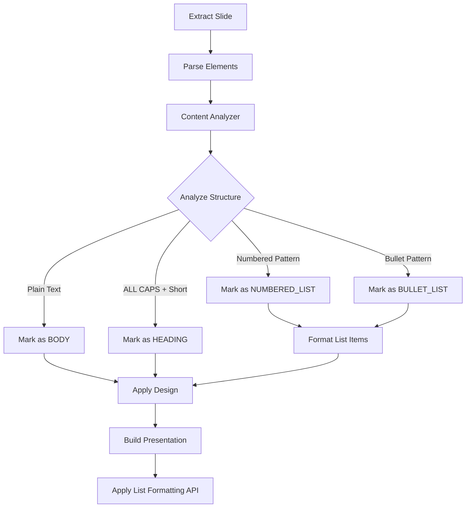

# Advanced Content Recognition & Structuring

## Overview
Enhanced the presentation design system to intelligently recognize and format structured content instead of just copying text. The system now analyzes content to identify titles, subtitles, headings, numbered lists, and bullet lists, applying appropriate formatting and visual hierarchy.

## New Features

### 1. **Content Structure Analysis**
New module: `presentation_design/extraction/content_analyzer.py`

**Capabilities:**
- ✅ **Numbered List Detection** - Recognizes patterns like "1.", "2)", "3:"
- ✅ **Bullet List Detection** - Identifies bullets: •, -, *, –, —
- ✅ **Emphasis Recognition** - Detects ALL CAPS text for headings
- ✅ **Title Case Detection** - Identifies capitalized headings
- ✅ **Logical Sectioning** - Groups related content elements

**Pattern Matching:**
```python
# Numbered lists: 1. Item, 2) Item, 3: Item
NUMBERED_LIST_PATTERN = r'^\s*(\d+)[.):]\s+(.+)'

# Bullet lists: • Item, - Item, * Item
BULLET_PATTERN = r'^\s*[•\-\*–—]\s+(.+)'

# Emphasis: ALL CAPS TEXT
ALL_CAPS_PATTERN = r'^[A-ZА-ЯЁ\s\d\W]+$'
```

### 2. **Intelligent Role Detection**

The system now automatically refines element roles based on:

| Factor | Detection Logic | Result |
|--------|----------------|---------|
| Position | First element on slide | Likely TITLE |
| Position | Second element on first slide | Likely SUBTITLE |
| Content | Short text (<100 chars) + ALL CAPS | HEADING |
| Content | Contains numbered/bullet patterns | LIST (formatted) |
| Position | Last element + short (<50 chars) | FOOTER |

### 3. **List Formatting**

**Before:**
```
1. First item
2. Second item
3. Third item
```
Just plain text, no visual distinction.

**After:**
- ✅ Proper bullet points using Google Slides API
- ✅ Consistent indentation (20 PT)
- ✅ Spacing between items (4 PT above/below)
- ✅ Slightly smaller font for better readability
- ✅ Automatic list marker generation

**List Types Supported:**
- **Numbered Lists** - Uses `NUMBERED` bullet preset
- **Bullet Lists** - Uses `BULLET_DISC_CIRCLE_SQUARE` preset

### 4. **Enhanced Layout System**

Updated templates with positions for all content types:

```json
"content_slide": {
  "title_position": {"x": 40, "y": 30, "width": 640, "height": 60},
  "heading_position": {"x": 40, "y": 110, "width": 640, "height": 50},
  "body_position": {"x": 40, "y": 170, "width": 640, "height": 280},
  "footer_position": {"x": 40, "y": 460, "width": 640, "height": 30}
}
```

**Benefits:**
- Clear visual hierarchy
- Proper spacing between sections
- Consistent positioning across slides
- More content area (640 PT width vs 600 PT)

## Technical Implementation

### Content Analysis Pipeline



### Code Flow

1. **Extraction Phase** (`content_parser.py`)
   - Extracts raw text from Google Slides
   - Calls `ContentAnalyzer.detect_slide_sections()`
   - Analyzes each element's structure
   - Refines roles based on content and position

2. **Design Phase** (`design_applicator.py`)
   - Checks `text_analysis` metadata
   - For lists: calls `_handle_list_element()`
   - Formats list items with consistent markers
   - Applies appropriate typography
   - Uses increased line height (1.6) for lists

3. **Generation Phase** (`presentation_builder.py`)
   - Creates text boxes with formatted content
   - Applies text styling
   - For lists: calls `_apply_list_formatting()`
   - Uses Google Slides API `createParagraphBullets`
   - Applies indentation and spacing

## Example Transformations

### Example 1: Numbered List

**Input:**
```
Ключевые задачи:
1. Разработать прототип
2. Провести тестирование
3. Внедрить в производство
```

**Output:**
- Heading: "Ключевые задачи:" (larger, bold)
- Numbered list with proper:
  - Auto-numbering by Google Slides
  - Indentation
  - Spacing between items
  - Slightly smaller font

### Example 2: Bullet List

**Input:**
```
Преимущества решения:
• Высокая производительность
• Простота использования
• Масштабируемость
```

**Output:**
- Heading: "Преимущества решения:" (larger, bold)
- Bullet list with:
  - Disc bullets
  - Proper indentation
  - Consistent spacing

### Example 3: Mixed Content

**Input:**
```
ВАЖНЫЕ ПОКАЗАТЕЛИ

Рост продаж:
1. Q1: +15%
2. Q2: +23%
3. Q3: +31%

Следующие шаги...
```

**Output:**
- Title: "ВАЖНЫЕ ПОКАЗАТЕЛИ" (ALL CAPS detected → HEADING)
- Heading: "Рост продаж:" (position-based)
- Numbered list: Q1-Q3 data (formatted)
- Footer: "Следующие шаги..." (bottom position)

## API Requests Generated

For each list item, the system generates:

```json
{
  "createParagraphBullets": {
    "objectId": "element_0_1",
    "textRange": {"startIndex": 0, "endIndex": 25},
    "bulletPreset": "NUMBERED"
  }
}
```

```json
{
  "updateParagraphStyle": {
    "objectId": "element_0_1",
    "textRange": {"startIndex": 0, "endIndex": 25},
    "style": {
      "indentStart": {"magnitude": 20, "unit": "PT"},
      "spaceAbove": {"magnitude": 4, "unit": "PT"},
      "spaceBelow": {"magnitude": 4, "unit": "PT"}
    }
  }
}
```

## Benefits

### Readability
- ✅ Clear visual hierarchy
- ✅ Proper spacing between sections
- ✅ Lists are visually distinct from body text
- ✅ Headings stand out with appropriate emphasis

### Professional Appearance
- ✅ Consistent formatting across all slides
- ✅ Proper use of typography (sizes, weights, colors)
- ✅ Clean, organized layout
- ✅ Not just "copy-paste" text

### Intelligent Processing
- ✅ Automatic content type detection
- ✅ Context-aware role assignment
- ✅ Smart formatting based on content structure
- ✅ No manual intervention required

## Files Modified

1. **New File:** `presentation_design/extraction/content_analyzer.py`
   - Core content analysis logic
   - Pattern matching for lists and emphasis
   - Role refinement algorithms

2. **Modified:** `presentation_design/extraction/content_parser.py`
   - Integrated ContentAnalyzer
   - Calls `detect_slide_sections()` after parsing

3. **Modified:** `presentation_design/design/design_applicator.py`
   - Added `_handle_list_element()` method
   - Checks for structured content
   - Formats lists with appropriate styling

4. **Modified:** `presentation_design/generation/presentation_builder.py`
   - Added `_apply_list_formatting()` method
   - Generates `createParagraphBullets` requests
   - Applies indentation and spacing

5. **Modified:** Template files
   - Added heading_position and footer_position
   - Improved spacing and dimensions
   - Better content area utilization

## Testing

To test the enhanced features:

1. Create a presentation with:
   - Title slide with title and subtitle
   - Content slide with numbered list (1. 2. 3.)
   - Content slide with bullet list (• - *)
   - Content slide with ALL CAPS heading

2. Process through web app at http://localhost:5000

3. Expected results:
   - Titles are properly sized and positioned
   - Lists have proper bullets/numbers
   - Headings stand out visually
   - Clean, professional layout

## Future Enhancements

Potential additions:
- Sub-lists (nested bullets)
- Table detection and formatting
- Image placement optimization
- Custom bullet styles per template
- Multi-column layouts for lists
- Smart text wrapping and overflow handling
